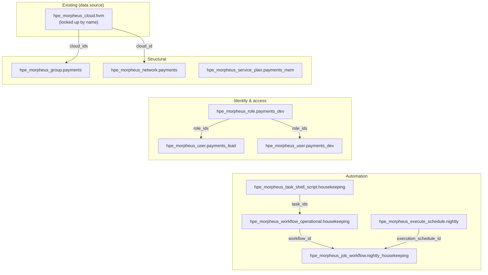

# Writing HPE Terraform with GitHub Copilot: A Beginner's Guide

*This post is an introduction to using GitHub Copilot as a coding assistant
while you write [`HPE/hpe`](https://registry.terraform.io/providers/HPE/hpe/latest)
Terraform configuration — from an empty folder to a successful `terraform plan`.
It's written for people who are still getting comfortable with Terraform or
OpenTofu, so we'll explain terms as we go. Along the way, we'll also cover how
to check what the assistant writes against real provider documentation, rather
than just trusting it.*

> **Sources.** Everything below is checked against the official
> [`HPE/hpe` provider documentation](https://registry.terraform.io/providers/HPE/hpe/latest/docs)
> and its source code repository,
> [`HPE/terraform-provider-hpe`](https://github.com/HPE/terraform-provider-hpe).
> Provider details change between versions, so always check the docs for the
> version you're actually using before you apply anything.

---

## The challenge: there's a lot to remember

If you've started writing Terraform for a real provider, you've probably hit
this problem: providers have a *lot* of resources, and each resource has its
own long list of precisely spelled attribute names. The `HPE/hpe` provider,
which manages Morpheus (HPE's cloud management platform), is no exception —
names like `provision_type_code`, `default_group_access`, and
`password_wo_version` aren't things anyone just remembers. They also change
between provider versions.

In practice, this means a lot of switching back and forth between your editor
and the documentation: copying an example, running a check, seeing an
`Unsupported argument` error, and fixing it. An AI coding assistant like
GitHub Copilot can take over a lot of that repetitive back-and-forth. But
here's the catch: if you don't give it the right information to work from, it
can just as easily suggest an attribute that *sounds* right but doesn't
actually exist in your provider version.

This post shows how to use Copilot to write the repetitive parts of your
configuration, while you keep checking its suggestions against real provider
sources — so the `.tf` files you end up with actually work.

---

## What do we mean by "AI-assisted" infrastructure code?

First, a quick primer if you're new to this: **Terraform** (and its
open-source sibling **OpenTofu**) let you describe infrastructure — servers,
networks, user accounts, and so on — as plain text configuration files, using
a language called HCL. Instead of clicking through a web console, you write
down what you *want to exist*, and Terraform figures out how to make it so.
This general approach is called "infrastructure as code."

In an AI-assisted workflow, you describe what you need in plain English, and
the assistant drafts a first version of the configuration for you. You then
read through what it produced, correct anything that's off, and use
Terraform's own commands to check the result. Terraform happens to be a great
fit for this kind of back-and-forth, for three reasons:

- **It's declarative.** You describe the end result you want, not a list of
  steps to get there. That maps naturally onto a plain-language request like
  *"give me a Morpheus group and a VMware cloud inside it."*
- **It's checkable.** Two built-in commands, `terraform validate` and
  `terraform plan`, give you (and the assistant) a fast, reliable way to know
  whether the configuration actually works — before anything is created for
  real.
- **It's well documented.** Providers publish machine-readable schemas
  (precise descriptions of every resource and attribute) and generated docs,
  so an assistant that's pointed at the right source can look up the *exact*
  attribute name instead of guessing.

None of this replaces your own judgment. The assistant helps with the
repetitive, syntax-heavy parts of the job. You're still the one deciding
things like which cloud type, which permissions, and which tenant are
actually correct for your situation.

This post uses the **HPE Terraform provider** (`HPE/hpe`) as its running
example. It's HPE's single, actively developed provider, and it's gradually
replacing the older `gomorpheus/morpheus` provider. GitHub Copilot plays the
role of pair-programmer throughout.

---

## Getting started

You need three things before you begin: the right tools installed, a project
to work in, and an assistant that has enough context to be useful.

### 1. Install the tooling

- **Terraform 1.11 or later, *or* OpenTofu 1.11 or later.** The `HPE/hpe`
  provider is published to both the
  [Terraform Registry](https://registry.terraform.io/providers/HPE/hpe/latest)
  and the [OpenTofu Registry](https://search.opentofu.org/provider/hpe/hpe/latest),
  and it works the same way with either one — they both speak the same
  provider plugin protocol under the hood. This minimum version is also needed
  for features used later in the article, including the write-only password
  field on `hpe_morpheus_user`.
- **GitHub Copilot** — in your editor (VS Code, JetBrains, Neovim, and so on)
  and/or the **Copilot CLI** in your terminal, if you'd rather work
  conversationally.
- **The HPE Terraform provider itself**, declared in a `required_providers`
  block (you'll see one below). Terraform (or OpenTofu) downloads it
  automatically the first time you run `terraform init` / `tofu init`.

> **Terraform or OpenTofu — does it matter?** Not really, for the purposes of
> this post. We say "Terraform" throughout to keep things simple, but
> everything here applies equally to OpenTofu: the same `HPE/hpe` provider,
> the same configuration files, the same feedback loop. Just swap the command
> name (`terraform validate` becomes `tofu validate`, and so on). Use whichever
> your team has already standardized on.

### 2. Scaffold the project

"Scaffolding" just means setting up the basic file layout before you write any
real configuration. Ask Copilot to do this and you'll typically get something
like:

```
.
├── versions.tf        # required_providers + provider config
├── variables.tf       # url, credentials, toggles
├── main.tf            # the actual resources
├── outputs.tf         # useful IDs to surface
└── terraform.tfvars   # your (gitignored) values
```

The trick to a good first prompt is being specific about **provider, version,
and what you actually want**:

> *"Scaffold a Terraform project using the HPE/hpe provider (v1.5+) that connects
> to a Morpheus appliance. Put the provider config in versions.tf, take the URL
> and an access token from variables, and support a toggle for self-signed
> certs."*

### 3. Give the assistant the right context

If there's one thing that makes the biggest difference to output quality,
it's **context** — the information you give the assistant before asking it to
generate anything. Before you start:

- Open (or point Copilot at) any `.tf` files you already have, so it follows
  your existing conventions instead of inventing new ones.
- Tell it the **exact provider version** you're using. Attribute names and
  requirements change between versions — saying "the HPE provider" is vague,
  but "`HPE/hpe` 1.5.0" isn't.
- Mention any **quirks of your environment** up front — for example, *"the
  appliance has a self-signed certificate"* — so the generated configuration
  includes `insecure = true` from the start, instead of failing the first time
  you try to apply it.

### 4. Initialize and validate

```bash
terraform init      # downloads the HPE/hpe provider
terraform validate  # type-checks the configuration
terraform plan      # shows what would change (read-only)
```

Think of `validate` and `plan` as your safety net. `validate` checks that your
configuration is syntactically correct and that every attribute you've used
actually exists on that resource. `plan` goes further: it shows you exactly
what Terraform *would* create, change, or destroy — without actually doing
it. In a CLI-based workflow, Copilot can run these commands itself and read
the output, so a misspelled attribute gets caught and fixed within seconds,
long before anything reaches your real appliance.

---

## How to double-check what the assistant writes

An AI-generated configuration can include a resource type or attribute that
*looks* completely reasonable but simply isn't supported by the provider
version you're using. The safest habit is to check each thing you're unsure
about against a real source, and then let the Terraform toolchain confirm the
whole configuration. Here's a practical pecking order for where to look,
starting with what's most reliable.

### 1. Your own codebase (check here first)

Before looking anywhere else, look at the `.tf` files already in your
project. If your repository already uses `hpe_morpheus_task_shell_script` a
particular way, that working example beats any outside documentation — it's
real, it matches the provider version you're actually running, and it follows
your team's own conventions. Search your own repo before searching the web.

### 2. The GitHub MCP server — reading the provider's source directly

You may not have run into **MCP** before: it stands for
[Model Context Protocol](https://modelcontextprotocol.io/), and it's a way of
giving an AI assistant *tools* to use, not just text to read. The **GitHub MCP
server** is one such tool — it lets Copilot read files and search code
directly inside the `HPE/terraform-provider-hpe` repository. That means it
can open the generated documentation for the exact resource you're asking
about — say, `docs/resources/morpheus_cloud.md` — and copy the attribute
names straight from the provider's own source tree, instead of relying on
memory. Reading the definition directly from the provider's repository is the
difference between *assuming* an attribute is called `group_id` and actually
confirming it.

### 3. The official docs and the Terraform Registry

The [Terraform Registry](https://registry.terraform.io/providers/HPE/hpe/latest/docs)
publishes that same generated schema, along with — importantly — the
**provider version** each attribute belongs to, plus hand-written guides for
migration and examples. If your question is "does version 1.5.0 support X?",
the Registry (which is pinned to a specific version) has a real answer, in a
way that an AI model's general memory simply can't.

### 4. A targeted web search — for anything that moves quickly

Some details — the shape of a REST API response, a recent behavior change, an
error message you've never seen before — live outside the provider's own
docs. A focused search of official HPE documentation can fill those gaps.
Stick to first-party sources where you can, and treat anything you find as a
claim that still needs to be checked, not a settled fact.

### 5. Prove it with the toolchain

Reading the source material tells you the code *should* be correct; running
the toolchain tells you whether the whole configuration actually *is*:

- `terraform validate` immediately catches misspelled attribute names and
  type mismatches.
- `terraform plan` shows you the intended change is sensible before anything
  gets applied.
- `terraform console` lets you evaluate a single expression on its own, to
  confirm it resolves to what you expect.

In a CLI-based workflow, the assistant can run these commands itself and read
the results. That means an unsupported attribute gets caught right at
`validate` time. The loop is simple: generate, validate, read the error if
there is one, fix it, and validate again.

### The underlying principle

> Ground every resource definition in a real source — your own code, the
> provider source via MCP, or the versioned docs — and then let
> `validate`/`plan` confirm it works. Confidence comes from **checking a
> source and then verifying it**, never from an AI model's memory alone.

Working this way makes AI-assisted infrastructure code more trustworthy: every
generated resource can be traced back to a real definition, and checked with
exactly the same tools you'd use if you'd typed it all by hand.

---

## The basic building blocks

Most Morpheus configurations are built from a fairly small set of resource
types. Once you (and the assistant) know these, most requests just become
different combinations of the same pieces.

### The provider block

Everything starts here. In Terraform, a **provider** is the plugin that knows
how to talk to a particular system — in this case, Morpheus. Morpheus-related
resources live inside a `morpheus {}` block on the `hpe` provider:

```terraform
terraform {
  required_version = ">= 1.11.0"

  required_providers {
    hpe = {
      source  = "HPE/hpe"
      version = ">= 1.5.0"
    }
  }
}

provider "hpe" {
  morpheus {
    url          = var.morpheus_url
    access_token = var.morpheus_access_token
    insecure     = var.morpheus_insecure # true for self-signed certs
  }
}
```

### Structural resources

These are the resources that describe where things live:

| Resource | What it is |
|---|---|
| `hpe_morpheus_group` | An infrastructure group — think of it as a folder that organizes clouds and instances. |
| `hpe_morpheus_cloud` | A connection to an actual cloud environment (for example HPE VME/HVM, or VMware). |
| `hpe_morpheus_network` | A network attached to a cloud. |
| `hpe_morpheus_service_plan` | A sizing plan — the CPU, memory, and storage that instances get provisioned with. |

### Identity and access resources

These control who can do what:

| Resource | What it is |
|---|---|
| `hpe_morpheus_user` | A single user account. |
| `hpe_morpheus_role` | A set of permissions, assignable to a user or a tenant. |
| `hpe_morpheus_tenant` | A tenant — an isolated account — in a multi-tenant setup (more on this later). |

### Automation resources

These let Morpheus do things on a schedule or in response to events:

| Resource | What it is |
|---|---|
| `hpe_morpheus_task_shell_script` / `_python_script` / `_powershell_script` | A task that runs a script, either on a guest machine or on the appliance itself. |
| `hpe_morpheus_workflow_operational` / `_provisioning` | A workflow that chains several tasks together. |
| `hpe_morpheus_execute_schedule` | A schedule that decides when a job runs. |
| `hpe_morpheus_job_workflow` | A job that connects a workflow to a target and, optionally, a schedule. |

### Data sources: look things up, don't recreate them

If something already exists — say, a cloud your team set up months ago — you
don't want Terraform trying to create it again. Instead, use a **data
source**: a read-only lookup that finds an existing object by name and gives
you its ID, so you can reference it from your own resources:

```terraform
data "hpe_morpheus_cloud" "existing" {
  name = "Production HVM"
}

resource "hpe_morpheus_group" "payments" {
  name      = "Payments"
  cloud_ids = [data.hpe_morpheus_cloud.existing.id]
}
```

This example looks up an existing cloud and gives a new group access to it.
That's the basic pattern behind the AI-assisted workflow: describe the
structure you want, ask the assistant for a starting point, check it, and
review the plan before you apply anything.

---

## Authentication: username/password or access token?

The `HPE/hpe` provider supports username/password and access-token
authentication for a Morpheus appliance. Both need the appliance's `url`, and
both accept an `insecure = true` setting if your appliance uses a self-signed
(untrusted) TLS certificate. Newer provider versions also support identity
options for HPE Private Cloud Enterprise deployments; check the authentication
guide for the provider version you're using.

### Option A — username and password

```terraform
provider "hpe" {
  morpheus {
    url      = var.morpheus_url
    username = var.morpheus_username
    password = var.morpheus_password
  }
}
```

- **Good for:** simplicity — there's no token to generate ahead of time.
- **Watch out for:** these are *standing* credentials — long-lived and
  powerful. If they leak, whoever has them can do anything that account can
  do, until the password gets changed. Never write them directly into a
  `.tf` file; load them from variables backed by a secrets manager or
  environment variables, and prefer a dedicated automation account over a
  real person's login.

### Option B — access token

```terraform
provider "hpe" {
  morpheus {
    url          = var.morpheus_url
    access_token = var.morpheus_access_token
    insecure     = true # if the appliance cert is self-signed
  }
}
```

- **Good for:** it keeps your username and password out of the Terraform
  configuration and can be revoked or rotated independently. This is usually
  the better option for automated pipelines and CI/CD.
- **Watch out for:** a token is still a credential. Its lifetime and effective
  permissions depend on your Morpheus configuration and the account that
  created it, so store and rotate it as carefully as a password.

### So which should you use?

For quick, interactive experimentation on your own machine, username/password
may be the simplest option. For **anything automated or shared** — pipelines,
scheduled jobs, or a team environment — prefer an **access token**, so your
primary username and password stay out of the configuration.

Whichever one you choose, the same basic rules apply. It's worth stating
these to your assistant explicitly, so it never quietly writes a secret
straight into a file:

- **Never** hard-code credentials in `.tf` files. Always use variables.
- Keep `terraform.tfvars` (and any `*.auto.tfvars` file holding secrets) **out
  of git**, using `.gitignore`.
- Mark credential variables `sensitive = true`, so they don't get printed in
  plan or apply output.

---

## A worked example: a self-service team environment

Individual building blocks are easy to understand on their own. The real
value shows up when you combine them. Here's a more involved, realistic
request you might hand to the assistant:

> *"Stand up a self-service environment for the **Payments** team: their own
> infrastructure group on our existing HVM cloud, a dedicated network, a
> memory-optimised service plan, a locked-down role, two users, and a nightly
> housekeeping workflow that runs a shell task. Add the existing cloud to the
> group rather than recreate it, keep all credentials in variables, and schedule
> the workflow for 02:00."*

That one request touches almost every building block from the previous
section. A well-grounded assistant turns it into something like this:

```terraform
# --- versions.tf ---
terraform {
  required_version = ">= 1.11.0"

  required_providers {
    hpe = {
      source  = "HPE/hpe"
      version = ">= 1.5.0"
    }
  }
}

# --- variables.tf ---
variable "morpheus_url" { type = string }
variable "morpheus_access_token" {
  type      = string
  sensitive = true
}
variable "morpheus_insecure" {
  type    = bool
  default = false
}
variable "payments_network_type_id" {
  type        = number
  description = "Network type ID supported by the selected HVM cloud"
}
variable "payments_network_config" {
  type        = any
  description = "Cloud-specific settings required by the selected network type"
}
variable "payments_lead_password" {
  type      = string
  sensitive = true
}
variable "payments_dev_password" {
  type      = string
  sensitive = true
}

# --- main.tf ---
provider "hpe" {
  morpheus {
    url          = var.morpheus_url
    access_token = var.morpheus_access_token
    insecure     = var.morpheus_insecure
  }
}

# Reference the existing HVM cloud instead of recreating it.
data "hpe_morpheus_cloud" "hvm" {
  name = "Production HVM"
}

# 1. Structural: a group, a network and a sizing plan for the team.
resource "hpe_morpheus_group" "payments" {
  name = "Payments"

  # Add the existing HVM cloud to this group so the team can provision on it.
  cloud_ids = [data.hpe_morpheus_cloud.hvm.id]
}

resource "hpe_morpheus_network" "payments" {
  name     = "payments-app-net"
  cloud_id = data.hpe_morpheus_cloud.hvm.id
  group_id = hpe_morpheus_group.payments.id
  type_id  = var.payments_network_type_id
  cidr     = "10.42.10.0/24"
  gateway  = "10.42.10.1"
  config   = var.payments_network_config
}

resource "hpe_morpheus_service_plan" "payments_mem" {
  name                = "payments-mem-optimised"
  code                = "payments-mem-optimised"
  provision_type_code = "kvm"
  max_memory          = 16 * 1024 * 1024 * 1024  # 16 GB, in bytes
  max_storage         = 100 * 1024 * 1024 * 1024 # 100 GB, in bytes
  cores_per_socket    = 1
  max_cores           = 4
}

# 2. Identity & access: a scoped role and two users.
resource "hpe_morpheus_role" "payments_dev" {
  name        = "payments-developer"
  description = "Provision and manage instances in the Payments group"
  role_type   = "user"

  permissions = {
    # Deny every group by default, then grant only the Payments group.
    default_group_access = "none"
    group_permissions = [
      {
        id     = hpe_morpheus_group.payments.id
        access = "full"
      }
    ]

    # Allow common instance actions, but keep administration disabled.
    feature_permissions = [
      { code = "provisioning", access = "full" },
      { code = "provisioning-add", access = "full" },
      { code = "provisioning-edit", access = "full" },
      { code = "provisioning-delete", access = "full" },
      { code = "provisioning-power", access = "full" },
      { code = "provisioning-reconfigure", access = "full" },
      { code = "admin-zones", access = "none" },
    ]
  }
}

resource "hpe_morpheus_user" "payments_lead" {
  username            = "payments-lead"
  email               = "payments-lead@example.com"
  password_wo         = var.payments_lead_password
  password_wo_version = 1
  role_ids            = [hpe_morpheus_role.payments_dev.id]
}

resource "hpe_morpheus_user" "payments_dev" {
  username            = "payments-dev"
  email               = "payments-dev@example.com"
  password_wo         = var.payments_dev_password
  password_wo_version = 1
  role_ids            = [hpe_morpheus_role.payments_dev.id]
}

# 3. Automation: a reporting task, workflow, schedule and scheduled job.
resource "hpe_morpheus_task_shell_script" "housekeeping" {
  name           = "payments-housekeeping"
  source_type    = "local"
  execute_target = "local"
  script_content = <<-EOT
    #!/usr/bin/env bash
    echo "Payments housekeeping report generated at $(date -u)"
    find /var/tmp -type f -mtime +7 -print
  EOT
}

resource "hpe_morpheus_workflow_operational" "housekeeping" {
  name     = "payments-nightly-housekeeping"
  task_ids = [tonumber(hpe_morpheus_task_shell_script.housekeeping.id)]
}

resource "hpe_morpheus_execute_schedule" "nightly" {
  name      = "payments-0200"
  schedule  = "0 2 * * *" # cron syntax
  time_zone = "Etc/UTC"
  enabled   = true
}

resource "hpe_morpheus_job_workflow" "nightly_housekeeping" {
  name                  = "payments-nightly-housekeeping"
  workflow_id           = tonumber(hpe_morpheus_workflow_operational.housekeeping.id)
  schedule_mode         = "scheduled"
  execution_schedule_id = tonumber(hpe_morpheus_execute_schedule.nightly.id)
  context_type          = "appliance"
  enabled               = true
}
```

The network type and its `config` settings are inputs because they depend on
the cloud and network integration configured in your Morpheus appliance. Look
up the supported network type and its required settings before supplying those
values in `terraform.tfvars`. Using an input here avoids presenting an
environment-specific numeric ID as though it were universal.

Notice a few things the assistant *didn't* do: it didn't invent the cloud
from scratch (it looked it up with a data source), it didn't write the token
or either user's password directly into the file, and every ID is wired
through a reference rather than typed out as a literal value. The two users
also use the provider's **write-only** `password_wo` attribute — a value that
Terraform or OpenTofu sends to Morpheus but never saves in its own state file,
which needs Terraform 1.11 or later or OpenTofu 1.11 or later. Those habits are
exactly what checking sources instead of guessing gets you — and, in fact, this
whole block passes `terraform validate` against `HPE/hpe` as written.

### What that example builds

These blocks aren't independent of each other — they form a small dependency
graph, wired together by ID. Here's the shape of what gets created:



The solid arrows are hard references — Terraform's dependency graph makes
sure it creates the cloud lookup, the role, the task, the workflow, and the
schedule *before* whatever depends on them. The four tiers — the **existing**
cloud, the **structural** group/network/plan, **identity** (role and users), and
**automation** (task/workflow/schedule/job) — stack top-to-bottom in the
diagram, which roughly matches the order Terraform creates them in. (The
Payments group also logically *scopes* the network and users; that relationship
is left off the diagram to keep the arrows readable.)

### A closer look at the role

The first draft of that role was actually a little *too* bare-bones — just a
`name` and a `description`:

```terraform
resource "hpe_morpheus_role" "payments_dev" {
  name        = "payments-developer"
  description = "Provision + manage instances within the Payments group only"
}
```

That's valid Terraform — it passes `validate` just fine — but it's
misleading. The description *promises* group-scoped, provision-only access,
but nothing in the resource actually enforces it. `name` is the only
required attribute, so you'd end up with a role that just gets whatever
defaults the provider happens to apply — the "…within the Payments group
only" part is just a comment, as far as the API is concerned. This is exactly
the kind of gap that checking the real schema uncovers: it turns out the role
resource has a lot more to offer.

The `hpe_morpheus_role` resource has two things worth understanding:

- **`role_type`** — either `user` or `tenant`. A *user* role controls what an
  individual user can access — features, groups, instance types. A *tenant*
  role sets the **ceiling** of permissions an entire sub-tenant can be granted.
  They're not interchangeable, and some attributes only make sense for one or
  the other (`default_group_access` is a user-role idea; `multitenant` belongs
  to tenant/master roles).
- **`permissions`** — a nested block that's where the actual authority lives.
  It combines broad **defaults** (`default_group_access`,
  `default_instance_type_access`, `default_task_access`,
  `default_workflow_access`, and so on) with **fine-grained overrides** for
  specific objects (`group_permissions`, `cloud_permissions`,
  `feature_permissions`, `instance_type_permissions`,
  `workflow_permissions`, and more). Access levels are typically one of
  `none`, `read`, `full`, or `default`.

So the fuller version above actually *does* what its description claims: it
denies access to every group by default, grants `full` access to the Payments
group, enables listing, creating, editing, deleting, powering, and reconfiguring
instances, and leaves the administration surface (`admin-zones`) switched off:

```terraform
permissions = {
  default_group_access = "none"
  group_permissions = [
    { id = hpe_morpheus_group.payments.id, access = "full" }
  ]
  feature_permissions = [
    { code = "provisioning", access = "full" },
    { code = "provisioning-add", access = "full" },
    { code = "provisioning-edit", access = "full" },
    { code = "provisioning-delete", access = "full" },
    { code = "provisioning-power", access = "full" },
    { code = "provisioning-reconfigure", access = "full" },
    { code = "admin-zones",  access = "none" },
  ]
}
```

Those `feature_permissions` codes (`provisioning`, `admin-zones`, `backups`,
`catalog`, and so on) come from a fixed list the provider documents in full —
another place where checking the docs beats guessing, since they're easy to
misremember. A handy pattern to reach for is **deny-by-default,
grant-by-exception**: set the `default_*` levels low, and then list only the
specific groups, clouds, and features the role should actually be able to
reach.

---

## A note on multitenancy

Everything above assumes a single tenant, but the HPE provider also supports
Morpheus's **multi-tenant** model. A "tenant" here means an isolated account
within the same Morpheus appliance — think of it like separate customers or
business units sharing one platform, each with their own users, clouds, and
groups, but unable to see each other's resources. Resources like
`hpe_morpheus_tenant`, tenant-scoped roles, and per-tenant clouds/groups/users
let you set up several of these isolated tenants from one configuration.

There's real nuance here — in the `HPE/hpe` provider's account model, Morpheus
tenancy is *flat* (sub-tenants aren't nested under whichever tenant created
them), while roles marked as multi-tenant can be propagated from a master
tenant. That's enough complexity that it deserves its own dedicated post.
(Worth noting: the Morpheus platform itself now supports **True N-Tier /
recursive** multi-tenancy as of Enterprise **v8.1.0**, and the provider's
schema may not have fully caught up yet.) We won't go further into it here —
just treat multitenancy as a *"yes, this scales to many tenants"* footnote, and
a pointer toward a future, dedicated walkthrough.

---

## A follow-up: Morpheus, MCP, and GreenLake Intelligence

This post focuses on building a solid foundation with the `HPE/hpe`
provider. A follow-up post will explore how this workflow grows beyond just
generating configuration, by bringing in Morpheus's own capabilities and
[HPE GreenLake Intelligence](https://www.hpe.com/us/en/greenlake/intelligence.html)
to support broader AI-assisted operations across a hybrid environment.

That follow-up will also look more closely at where
[Model Context Protocol (MCP)](https://modelcontextprotocol.io/) fits in. In
this post, the GitHub MCP server gives Copilot controlled access to the
provider's source and documentation. A second post will consider MCP-based
connections to operational tools and Morpheus workflows — while being careful
to separate what's available today from what's still a prototype or just
planned.

---

## Wrapping up

The AI-assisted workflow for HPE Terraform boils down to a short, repeatable
loop:

1. **Scaffold** the project with a specific, version-pinned prompt.
2. Combine the **basic building blocks** (groups, clouds, networks, users,
   roles, tasks, workflows) to build what you actually need.
3. Pick an **authentication model** — access tokens for anything automated.
4. Let the assistant **ground** each definition in your own code, the
   provider source (via MCP), or the versioned docs…
5. …and **prove** it works with `validate` / `plan` before you apply anything.

You're still responsible for the design and the review; the assistant just
takes on the repetitive configuration and provider syntax. Multitenancy,
richer automation, Morpheus and GreenLake Intelligence integration, and
migrating off the legacy provider are all natural next topics that build on
this same foundation.

## Try it yourself

You can be up and running in a few minutes:

1. Install the [HPE Terraform provider](https://registry.terraform.io/providers/HPE/hpe/latest)
   (pin `version = ">= 1.5.0"`) and open the project in an editor with **GitHub
   Copilot** enabled.
2. Point Copilot at the provider source via the [GitHub MCP server](https://github.com/github/github-mcp-server),
   so it can ground resource and data-source definitions in
   `HPE/terraform-provider-hpe` instead of guessing.
3. Scaffold with a specific, version-pinned prompt (see *Getting started*),
   then combine the **building blocks** into whatever you need — feel free to
   reuse the worked example above as a starting point.
4. Run `terraform validate` and `terraform plan` on every change, and keep
   your credentials in variables and out of git.

Then describe the next thing you want, review what comes back, and let that
feedback loop do the rest. Give it a try on a small change today — and if you
build something worth sharing, let me know how it went.
