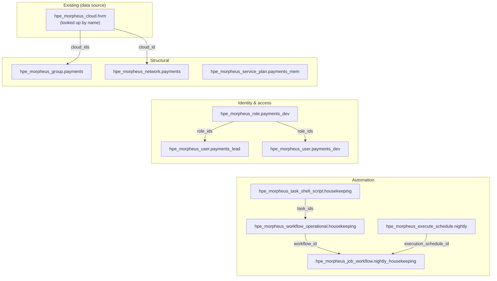

This post is an introduction to using GitHub Copilot as a coding assistant
while you write [`HPE/hpe`](https://registry.terraform.io/providers/HPE/hpe/latest)
Terraform configuration. It takes you from an empty folder to a successful
`terraform plan`. The post is for people who are still learning Terraform or
OpenTofu, so it explains terms as they appear. It also shows how to check the
assistant's output against provider documentation.

> **Sources.** Everything below is checked against the official
> [`HPE/hpe` provider documentation](https://registry.terraform.io/providers/HPE/hpe/latest/docs)
> and its source code repository,
> [`HPE/terraform-provider-hpe`](https://github.com/HPE/terraform-provider-hpe).
> Provider details change between versions, so always check the documentation for the
> version you're actually using before you apply anything.

---

## The challenge: many details to remember

Terraform providers can have many resources. Each resource has a long list of
precisely spelled attribute names. The `HPE/hpe` provider,
which manages HPE Morpheus Enterprise Software, is no exception. Names such as
`provision_type_code`, `default_group_access`, and
`password_wo_version` are difficult to remember. They can also change between
provider versions.

In practice, this means a lot of switching back and forth between your editor
and the documentation: copying an example, running a check, seeing an
`Unsupported argument` error, and fixing it. An AI coding assistant such as
GitHub Copilot can reduce that repetitive work. However, without the right
information, it can suggest an attribute that sounds correct but doesn't exist
in your provider version.

This post shows how to use Copilot to write the repetitive parts of your
configuration. You check its suggestions against provider sources so that the
resulting `.tf` files work as expected.

---

## What do we mean by "AI-assisted" infrastructure code?

**Terraform** and its open-source sibling **OpenTofu** let you describe
infrastructure, including servers, networks, and user accounts, in plain text
configuration files. These files use HashiCorp Configuration Language (HCL).
Instead of selecting options in a web console, you describe the resources that
you want. Terraform then determines how to create them. This approach is called
"infrastructure as code."

In an AI-assisted workflow, you describe what you need in plain English. The
assistant drafts the first version of the configuration. You review and
correct its output, and then use Terraform commands to check the result.
Terraform works well for this process for three reasons:

- **Declarative configuration.** You describe the end result, not a list of
  steps to get there. That maps naturally onto a plain-language request such as
  *"give me an infrastructure group and a VMware cloud inside it."*
- **Built-in checks.** The `terraform validate` and `terraform plan` commands
  check whether the configuration works before Terraform creates resources.
- **Detailed documentation.** Providers publish machine-readable schemas and
  generated documentation. These sources describe each resource and
  attribute, so the assistant can use exact names instead of guessing.

None of this replaces your own judgment. The assistant helps with the
repetitive, syntax-heavy parts of the job. You're still the one deciding
things like which cloud type, which permissions, and which tenant are
actually correct for your situation.

This post uses the **HPE Terraform provider** (`HPE/hpe`) for its examples.
This actively developed provider is gradually replacing the older
`gomorpheus/morpheus` provider. GitHub Copilot provides coding assistance
throughout the examples.

---

## Getting started

You need three things before you begin: the right tools installed, a project
to work in, and an assistant that has enough context to be useful.

### 1. Install the tooling

- **Terraform 1.11 or later, *or* OpenTofu 1.11 or later.** The `HPE/hpe`
  provider is published to both the
  [Terraform Registry](https://registry.terraform.io/providers/HPE/hpe/latest)
  and the [OpenTofu Registry](https://search.opentofu.org/provider/hpe/hpe/latest).
  It works with either tool because both use the same provider plugin protocol.
  This minimum version is also needed for features used later in the article,
  including the write-only password field on `hpe_morpheus_user`.
- **GitHub Copilot** — in your editor (VS Code, JetBrains, Neovim, and so on)
  or the **Copilot CLI** in your terminal, if you'd rather work
  conversationally.
- **The HPE Terraform provider itself**, declared in a `required_providers`
  block (you'll see one below). Terraform (or OpenTofu) downloads it
  automatically the first time you run `terraform init` or `tofu init`.

> **Terraform or OpenTofu — does it matter?** Not really, for the purposes of
> this post. We say "Terraform" throughout to keep things simple, but
> everything here applies equally to OpenTofu: the same `HPE/hpe` provider,
> the same configuration files, and the same review cycle. Swap the command
> name (`terraform validate` becomes `tofu validate`, and so on). Use whichever
> your team has already standardized on.

### 2. Scaffold the project

"Scaffolding" means setting up the basic file layout before you write the
configuration. Ask Copilot to create this structure:

```
.
├── versions.tf        # required_providers + provider config
├── variables.tf       # url, credentials, toggles
├── main.tf            # the actual resources
├── outputs.tf         # useful IDs to surface
└── terraform.tfvars   # your (gitignored) values
```

A useful first prompt specifies the **provider, version, and required
resources**:

> *"Scaffold a Terraform project using version 1.5.0 or later of the HPE/hpe
> provider. Connect it to an HPE Morpheus Enterprise Software appliance. Put
> the provider configuration in versions.tf. Take the URL and an access token
> from variables, and support a setting for self-signed certificates."*

### 3. Give the assistant the right context

**Context** is the information you give the assistant before asking it to
generate configuration. Better context improves the output. Before you start:

- Open (or point Copilot at) any `.tf` files you already have, so it follows
  your existing conventions instead of inventing new ones.
- Tell it the **exact provider version** you're using. Attribute names and
  requirements change between versions — saying "the HPE provider" is vague,
  but "`HPE/hpe` 1.5.0" isn't.
- Mention any **environment details** in the prompt. For example, state that
  *"the appliance has a self-signed certificate."* The generated configuration
  can then include `insecure = true` before you try to apply it.

### 4. Initialize and validate

```bash
terraform init      # downloads the HPE/hpe provider
terraform validate  # type-checks the configuration
terraform plan      # shows what would change (read-only)
```

Use `validate` and `plan` as verification steps. `validate` checks that your
configuration is syntactically correct and that every attribute you've used
actually exists on that resource. `plan` goes further: it shows you exactly
what Terraform *would* create, change, or destroy — without actually doing
it. In a command-line interface (CLI) workflow, Copilot can run these commands
and read the output. It can then correct a misspelled attribute before the
configuration reaches the appliance.

---

## How to double-check what the assistant writes

An AI-generated configuration can include a resource type or attribute that
looks reasonable but isn't supported by the provider version you're using.
Check uncertain details against a reliable source. Then use the Terraform
toolchain to confirm the complete configuration. Use the following sources in
order, starting with the most reliable.

### 1. Your own codebase (check here first)

Before looking anywhere else, look at the `.tf` files already in your
project. An existing use of `hpe_morpheus_task_shell_script` confirms how your
team uses the resource. It also matches the provider version and conventions
in your repository. Search your repository before searching the web.

### 2. The GitHub MCP server: read the provider source directly

[Model Context Protocol (MCP)](https://modelcontextprotocol.io/) gives an AI
assistant controlled access to tools and information. The **GitHub MCP server**
lets Copilot read files and search code in the
`HPE/terraform-provider-hpe` repository. For example, it can open the generated
documentation in `docs/resources/morpheus_cloud.md`. It can then confirm
whether an attribute is called `group_id`.

### 3. Official documentation and the Terraform Registry

The [Terraform Registry](https://registry.terraform.io/providers/HPE/hpe/latest/docs)
publishes the same generated schema. It also identifies the **provider
version** for each attribute and includes written guides for migration and
examples. Use the Registry for version-specific questions, such as whether
version 1.5.0 supports an attribute.

### 4. A targeted web search for updated information

Some details, such as the shape of an application programming interface (API)
response, a recent behavior change, or an unfamiliar error message, are outside
the provider documentation. A focused search of official HPE documentation can
fill those gaps.
Stick to first-party sources where you can, and treat anything you find as a
claim that still needs to be checked, not a settled fact.

### 5. Verify it with the toolchain

Reading the source material tells you the code *should* be correct; running
the toolchain tells you whether the whole configuration actually *is*:

- `terraform validate` immediately catches misspelled attribute names and
  type mismatches.
- `terraform plan` shows you the intended change is sensible before anything
  gets applied.
- `terraform console` lets you evaluate a single expression on its own, to
  confirm it resolves to what you expect.

In a CLI-based workflow, the assistant can run these commands itself and read
the results. That means an unsupported attribute gets caught right at
`validate` time. The loop is simple: generate, validate, read the error if
there is one, fix it, and validate again.

### The underlying principle

> Verify every resource definition against a reliable source: your code, the
> provider source by using MCP, or the versioned documentation. Then let
> `validate` and `plan` confirm that it works. Confidence comes from **checking a
> source and then verifying it**, never from an AI model's memory alone.

This process makes AI-assisted infrastructure code more trustworthy. You can
trace each generated resource to a real definition and check it with the same
tools used for manually written configuration.

---

## The basic building blocks

Most configurations for the platform use a small set of resource types. Once
you know these types, you can combine them to meet different requirements.

### The provider block

Start with the provider block. In Terraform, a **provider** is the plugin that
communicates with a particular system. Resources for HPE Morpheus Enterprise
Software use a `morpheus {}` block on the `hpe` provider:

```terraform
terraform {
  required_version = ">= 1.11.0"

  required_providers {
    hpe = {
      source  = "HPE/hpe"
      version = ">= 1.5.0"
    }
  }
}

provider "hpe" {
  morpheus {
    url          = var.morpheus_url
    access_token = var.morpheus_access_token
    insecure     = var.morpheus_insecure # true for self-signed certificates
  }
}
```

### Structural resources

These are the resources that describe where things live:

| Resource | What it is |
|---|---|
| `hpe_morpheus_group` | An infrastructure group that organizes clouds and instances. |
| `hpe_morpheus_cloud` | A connection to a cloud environment, such as HPE VM Essentials or VMware. |
| `hpe_morpheus_network` | A network attached to a cloud. |
| `hpe_morpheus_service_plan` | A sizing plan for the processor, memory, and storage assigned to instances. |

### Identity and access resources

These control who can do what:

| Resource | What it is |
|---|---|
| `hpe_morpheus_user` | A single user account. |
| `hpe_morpheus_role` | A set of permissions, assignable to a user or a tenant. |
| `hpe_morpheus_tenant` | A tenant — an isolated account — in a multi-tenant setup (covered in a future post). |

### Automation resources

These resources let the platform run tasks on a schedule or in response to events:

| Resource | What it is |
|---|---|
| `hpe_morpheus_task_shell_script`, `_python_script`, and `_powershell_script` | Tasks that run scripts on a guest machine or the appliance. |
| `hpe_morpheus_workflow_operational` and `_provisioning` | Workflows that connect several tasks. |
| `hpe_morpheus_execute_schedule` | A schedule that decides when a job runs. |
| `hpe_morpheus_job_workflow` | A job that connects a workflow to a target and, optionally, a schedule. |

### Data sources: look things up, don't recreate them

If a resource already exists, you don't want Terraform to create it again.
Instead, use a **data source**. This read-only lookup finds an existing object
by name and provides its identifier (ID) for other resources:

```terraform
data "hpe_morpheus_cloud" "existing" {
  name = "Production HVM"
}

resource "hpe_morpheus_group" "payments" {
  name      = "Payments"
  cloud_ids = [data.hpe_morpheus_cloud.existing.id]
}
```

This example looks up an existing cloud and gives a new group access to it.
This is the basic AI-assisted workflow. Describe the structure, ask the
assistant for a starting point, check the configuration, and review the plan
before applying it.

---

## Authentication: username and password or access token?

The `HPE/hpe` provider supports authentication by username and password or by
access token. Both methods need the appliance's `url`, and
both accept an `insecure = true` setting if your appliance uses a self-signed
(untrusted) Transport Layer Security (TLS) certificate. Newer provider
versions also support identity
options for HPE Private Cloud Enterprise deployments; check the authentication
guide for the provider version you're using.

### Option A — username and password

```terraform
provider "hpe" {
  morpheus {
    url      = var.morpheus_url
    username = var.morpheus_username
    password = var.morpheus_password
  }
}
```

- **Benefit:** There's no token to generate in advance.
- **Consideration:** These are *standing* credentials — long-lived and
  powerful. If they leak, whoever has them can do anything that account can
  do, until the password gets changed. Never write them directly into a
  `.tf` file; load them from variables backed by a secrets manager or
  environment variables, and prefer a dedicated automation account over a
  real person's login.

### Option B — access token

```terraform
provider "hpe" {
  morpheus {
    url          = var.morpheus_url
    access_token = var.morpheus_access_token
    insecure     = true # if the appliance cert is self-signed
  }
}
```

- **Benefit:** It keeps your username and password out of the Terraform
  configuration and can be revoked or rotated independently. This is usually
  the better option for automated pipelines and continuous integration and
  continuous delivery (CI/CD).
- **Consideration:** A token is still a credential. Its lifetime and effective
  permissions depend on the platform configuration and the account that
  created it, so store and rotate it as carefully as a password.

### So which should you use?

For interactive experiments on your own machine, a username and password might
be the simplest option. For automated or shared uses, such as pipelines,
scheduled jobs, or team environments, prefer an **access token**. This keeps
your primary username and password out of the configuration.

Whichever one you choose, the same basic rules apply. It's worth stating
these to your assistant explicitly, so it never quietly writes a secret
straight into a file:

- **Never** hard-code credentials in `.tf` files. Always use variables.
- Keep `terraform.tfvars` (and any `*.auto.tfvars` file holding secrets) **out
  of git**, using `.gitignore`.
- Mark credential variables `sensitive = true`, so they don't get printed in
  plan or apply output.

---

## A worked example: a self-service team environment

Individual building blocks are easy to understand on their own. The real
value shows up when you combine them. Here's a more involved, realistic
request you might hand to the assistant:

> *"Create a self-service environment for the **Payments** team: their own
> infrastructure group on our existing HPE VM Essentials cloud, a dedicated
> network, a memory-optimized service plan, and a restricted role. Add two users
> and a nightly housekeeping workflow that runs a shell task. Add the existing
> cloud to the group rather than recreate it, keep all credentials in variables,
> and schedule the workflow for 2 a.m. UTC."*

That one request touches almost every building block from the previous
section. The provider uses HVM identifiers for HPE VM Essentials resources. An
assistant that uses verified sources produces configuration like this:

```terraform
# --- versions.tf ---
terraform {
  required_version = ">= 1.11.0"

  required_providers {
    hpe = {
      source  = "HPE/hpe"
      version = ">= 1.5.0"
    }
  }
}

# --- variables.tf ---
variable "morpheus_url" { type = string }
variable "morpheus_access_token" {
  type      = string
  sensitive = true
}
variable "morpheus_insecure" {
  type    = bool
  default = false
}
variable "payments_network_type_id" {
  type        = number
  description = "Network type ID supported by the selected HVM cloud"
}
variable "payments_network_config" {
  type        = any
  description = "Cloud-specific settings required by the selected network type"
}
variable "payments_lead_password" {
  type      = string
  sensitive = true
}
variable "payments_dev_password" {
  type      = string
  sensitive = true
}

# --- main.tf ---
provider "hpe" {
  morpheus {
    url          = var.morpheus_url
    access_token = var.morpheus_access_token
    insecure     = var.morpheus_insecure
  }
}

# Reference the existing HVM cloud instead of recreating it.
data "hpe_morpheus_cloud" "hvm" {
  name = "Production HVM"
}

# 1. Structural: a group, a network and a sizing plan for the team.
resource "hpe_morpheus_group" "payments" {
  name = "Payments"

  # Add the existing HVM cloud to this group so the team can provision on it.
  cloud_ids = [data.hpe_morpheus_cloud.hvm.id]
}

resource "hpe_morpheus_network" "payments" {
  name     = "payments-app-net"
  cloud_id = data.hpe_morpheus_cloud.hvm.id
  group_id = hpe_morpheus_group.payments.id
  type_id  = var.payments_network_type_id
  cidr     = "10.42.10.0/24"
  gateway  = "10.42.10.1"
  config   = var.payments_network_config
}

resource "hpe_morpheus_service_plan" "payments_mem" {
  name                = "payments-mem-optimized"
  code                = "payments-mem-optimized"
  provision_type_code = "kvm"
  max_memory          = 16 * 1024 * 1024 * 1024  # 16 GB, in bytes
  max_storage         = 100 * 1024 * 1024 * 1024 # 100 GB, in bytes
  cores_per_socket    = 1
  max_cores           = 4
}

# 2. Identity and access: a scoped role and two users.
resource "hpe_morpheus_role" "payments_dev" {
  name        = "payments-developer"
  description = "Provision and manage instances in the Payments group"
  role_type   = "user"

  permissions = {
    # Deny every group by default, then grant only the Payments group.
    default_group_access = "none"
    group_permissions = [
      {
        id     = hpe_morpheus_group.payments.id
        access = "full"
      }
    ]

    # Allow common instance actions, but keep administration disabled.
    feature_permissions = [
      { code = "provisioning", access = "full" },
      { code = "provisioning-add", access = "full" },
      { code = "provisioning-edit", access = "full" },
      { code = "provisioning-delete", access = "full" },
      { code = "provisioning-power", access = "full" },
      { code = "provisioning-reconfigure", access = "full" },
      { code = "admin-zones", access = "none" },
    ]
  }
}

resource "hpe_morpheus_user" "payments_lead" {
  username            = "payments-lead"
  email               = "payments-lead@example.com"
  password_wo         = var.payments_lead_password
  password_wo_version = 1
  role_ids            = [hpe_morpheus_role.payments_dev.id]
}

resource "hpe_morpheus_user" "payments_dev" {
  username            = "payments-dev"
  email               = "payments-dev@example.com"
  password_wo         = var.payments_dev_password
  password_wo_version = 1
  role_ids            = [hpe_morpheus_role.payments_dev.id]
}

# 3. Automation: a reporting task, workflow, schedule and scheduled job.
resource "hpe_morpheus_task_shell_script" "housekeeping" {
  name           = "payments-housekeeping"
  source_type    = "local"
  execute_target = "local"
  script_content = <<-EOT
    #!/usr/bin/env bash
    echo "Payments housekeeping report generated at $(date -u)"
    find /var/tmp -type f -mtime +7 -print
  EOT
}

resource "hpe_morpheus_workflow_operational" "housekeeping" {
  name     = "payments-nightly-housekeeping"
  task_ids = [tonumber(hpe_morpheus_task_shell_script.housekeeping.id)]
}

resource "hpe_morpheus_execute_schedule" "nightly" {
  name      = "payments-0200"
  schedule  = "0 2 * * *" # cron syntax
  time_zone = "Etc/UTC"
  enabled   = true
}

resource "hpe_morpheus_job_workflow" "nightly_housekeeping" {
  name                  = "payments-nightly-housekeeping"
  workflow_id           = tonumber(hpe_morpheus_workflow_operational.housekeeping.id)
  schedule_mode         = "scheduled"
  execution_schedule_id = tonumber(hpe_morpheus_execute_schedule.nightly.id)
  context_type          = "appliance"
  enabled               = true
}
```

The network type and its `config` settings are inputs because they depend on
the cloud and network integration configured in the platform appliance. Look
up the supported network type and its required settings before supplying those
values in `terraform.tfvars`. Using an input avoids presenting an
environment-specific numeric ID as a universal value.

The assistant looks up the cloud with a data source instead of creating it. It
doesn't write the token or either user's password directly into the file.
Every ID uses a reference instead of a literal value.

The two users also use the provider's **write-only** `password_wo` attribute.
Terraform or OpenTofu sends this value to the platform but never saves it in
the state file. This attribute requires Terraform 1.11 or later or OpenTofu
1.11 or later. The complete block passes `terraform validate` against
`HPE/hpe` as written.

### What that example builds

These blocks aren't independent of each other — they form a small dependency
graph, wired together by ID. Here's the shape of what gets created:



The solid arrows are references. Terraform's dependency graph creates the
cloud lookup, role, task, workflow, and schedule before the resources that
depend on them. The diagram has four tiers: the **existing** cloud; the
**structural** group, network, and plan; **identity**, with a role and users;
and **automation**, with a task, workflow, schedule, and job. This order
approximately matches the resource creation order. The diagram omits the
Payments group's relationship to the network and users to keep it readable.

### A closer look at the role

The first draft of that role was too limited. It had only a `name` and a
`description`:

```terraform
resource "hpe_morpheus_role" "payments_dev" {
  name        = "payments-developer"
  description = "Provision + manage instances within the Payments group only"
}
```

This configuration is valid Terraform and passes `validate`, but it's
misleading. The description states that access is restricted to a group and
provisioning tasks, but the resource doesn't enforce those limits. Because
`name` is the only required attribute, the provider applies its defaults. The
phrase "within the Payments group only" has no effect on the API. Checking the
schema reveals the additional settings needed to enforce the restrictions.

The `hpe_morpheus_role` resource has two things worth understanding:

- **`role_type`** — either `user` or `tenant`. A *user* role controls what an
  individual user can access — features, groups, instance types. A *tenant*
  role sets the **ceiling** of permissions an entire sub-tenant can be granted.
  These role types aren't interchangeable, and some attributes apply to only
  one type. For example, `default_group_access` applies to user roles, while
  `multitenant` applies to tenant and master roles.
- **`permissions`** — a nested block that's where the actual authority lives.
  It combines broad **defaults** (`default_group_access`,
  `default_instance_type_access`, `default_task_access`,
  `default_workflow_access`, and so on) with **fine-grained overrides** for
  specific objects (`group_permissions`, `cloud_permissions`,
  `feature_permissions`, `instance_type_permissions`,
  `workflow_permissions`, and more). Access levels are typically one of
  `none`, `read`, `full`, or `default`.

The complete version enforces the restrictions in its description. It denies
access to every group by default and grants `full` access to the Payments
group. It also enables common instance operations and disables administration
through `admin-zones`:

```terraform
permissions = {
  default_group_access = "none"
  group_permissions = [
    { id = hpe_morpheus_group.payments.id, access = "full" }
  ]
  feature_permissions = [
    { code = "provisioning", access = "full" },
    { code = "provisioning-add", access = "full" },
    { code = "provisioning-edit", access = "full" },
    { code = "provisioning-delete", access = "full" },
    { code = "provisioning-power", access = "full" },
    { code = "provisioning-reconfigure", access = "full" },
    { code = "admin-zones",  access = "none" },
  ]
}
```

The provider documentation lists the available `feature_permissions` codes,
including `provisioning`, `admin-zones`, `backups`, and `catalog`. Check this
list instead of relying on memory. Use a **deny-by-default,
grant-by-exception** approach: set restrictive `default_*` levels, and then
list only the groups, clouds, and features that the role needs.

---

## A follow-up: HPE Morpheus Enterprise Software, Model Context Protocol, and HPE GreenLake Intelligence

This post focuses on building a solid foundation with the `HPE/hpe`
provider. A follow-up post will explain how this workflow can extend beyond
configuration generation by using the platform's capabilities and
[HPE GreenLake Intelligence](https://www.hpe.com/us/en/greenlake/intelligence.html)
to support broader AI-assisted operations across a hybrid environment.

That follow-up will also examine
[Model Context Protocol (MCP)](https://modelcontextprotocol.io/). In this post,
the GitHub MCP server gives Copilot controlled access to the provider source
and documentation. The second post will consider MCP-based connections to
operational tools and platform workflows. It will distinguish currently
available features from prototypes and planned work.

---

## Wrapping up

The AI-assisted workflow for HPE Terraform has five repeatable steps:

1. **Scaffold** the project with a specific, version-pinned prompt.
2. Combine the **basic building blocks** (groups, clouds, networks, users,
   roles, tasks, workflows) to build what you actually need.
3. Pick an **authentication model** — access tokens for anything automated.
4. Ask the assistant to **verify** each definition against your code, the
   provider source by using MCP, or the versioned documentation.
5. **Confirm** the configuration with `validate` and `plan` before applying it.

You're still responsible for the design and the review; the assistant just
takes on the repetitive configuration and provider syntax. Multitenancy,
richer automation, platform and HPE GreenLake Intelligence integration, and
migrating off the legacy provider are all natural next topics that build on
this same foundation.

## Try it yourself

To try the workflow:

1. Install the [HPE Terraform provider](https://registry.terraform.io/providers/HPE/hpe/latest)
   (pin `version = ">= 1.5.0"`) and open the project in an editor with **GitHub
   Copilot** enabled.
2. Point Copilot at the provider source via the [GitHub MCP server](https://github.com/github/github-mcp-server),
   so it can verify resource and data-source definitions against
   `HPE/terraform-provider-hpe` instead of guessing.
3. Scaffold with a specific, version-pinned prompt (see *Getting started*),
   then combine the **building blocks** into whatever you need — feel free to
   reuse the worked example above as a starting point.
4. Run `terraform validate` and `terraform plan` on every change, and keep
   your credentials in variables and out of git.

Then describe the next change, review the response, and repeat the process.
Start with a small change and share what you learn.

Please keep coming back to the [`HPE Developer Community blog`](https://developer.hpe.com/blog/) to learn more about HPE terraform provider and get more ideas on how you can use it in your everyday operations.
