# HPE Developer External Contributor Guide
**Version 2.0** - 13-Oct-2022

>**Note:** A recording of the training session delivered on April 30, 2021 is available [here](https://vimeo.com/544486602). 

>**IMPORTANT Note:** The recommended way for submitting your contribution is through the HPE Developer CMS editor as explained in this document. HPE Developer team provides review feedback to blog post authors, event card and platform page owners through GitHub. 

>Note: You may prefer to use MS-Word or Google doc (a Google account is needed) to submit your contributions such as a blog post. In this case, we recommend you check out the blog post [here](https://developer.hpe.com/blog/be-an-hpe-dev-blogger/) 

## Table of Contents

[Introduction](#introduction)

[Contribution Workflow Process](#contribution-workflow-process)

[Getting started](#getting-started)

[Contributing a new blog](#contributing-a-new-blog)

[Editing a blog post that is already published](#editing-a-blog-post-that-is-already-published)

[Creating and editing a platform page](#creating-and-editing-a-platform-page)

[Adding an Event](#adding-an-event)

[Tips and trick using the CMS Editor](#tips-and-trick-using-the-cms-editor)


## Introduction

This guide is intended for anyone interested in contributing to the [HPE
DEV Community](https://hpedev.io). The document covers how to
contribute a new blog or how to update a platform page.

**Note:** A recording of the training session delivered on April 30, 2021 is available [here](https://vimeo.com/544486602). 

The process described in this guide requires minimum familiarity with Git
and an account on GitHub.com. You can find a tutorial on Git in this
[3-part blog article](https://developer.hpe.com/blog/get-involved-in-the-open-source-community-part-1-getting-started-with-gi).

Please contact [HPE Developer Team](mailto:hpedev@hpe.com?subject=Support%20for%20contribution%20to%20HPE%20DEV%20Community) for more support.

## Contribution workflow process

<center>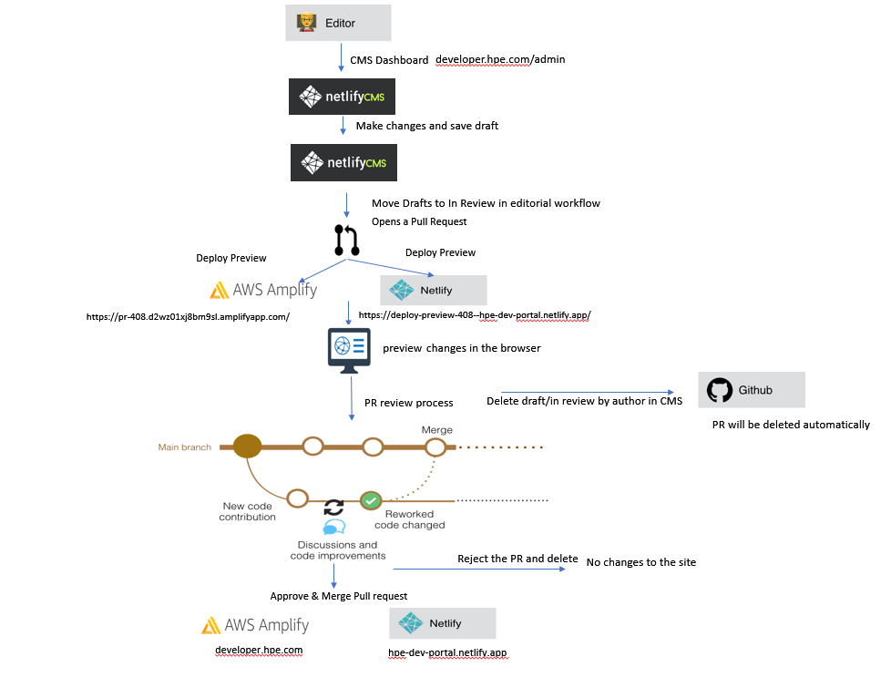</center>

HPE Developer portal is a static website built using an open-source frontend framework Gatsby JS and hosted on Netlify, AWS Amplify platforms with [GitHub](https://guides.github.com/) for version control and collaboration.
   * **[Gatsby](https://www.gatsbyjs.com/)** is an open source framework based on [ReactJS](https://reactjs.org/) that helps developers quickly build websites and apps.
   * **[Netlify](https://www.netlify.com/)** (_a web developer platform and web hosting infrastructure_) hosts the Content Management System (CMS) to edit the website content. Netlify CMS allows you to create, edit and preview contributions (for example a new blog post, a new event card or platform page updates). Netlify CMS also opens a GitHub Pull Request (PR) as a method of submitting your contribution for HPE Developer team to review your contribution and conduct an editorial review before its publication.
   * **[AWS Amplify](https://aws.amazon.com/amplify/)** (_a web hosting infrastructure and a framework platform for building secure and scalable web applications_) hosts the front end of the HPE Developer website [developer.hpe.com](https://developer.hpe.com). It provides the deploy previews for each commit to the GitHub repository.

Netlify and AWS Amplify has been both configured to integrate with GitHub version control system to provide a continuous integration/continuous deployment (CI/CD) environment and deploy changes to the HPE Developer website whenever HPE Developer team pulls in your contributions and merges them into the master branch in GitHub.


## Getting started

1.  Make sure you are connected to **your personal GitHub account**. If you
    don't have an account, you can create one now [here](https://github.com/join).

2.  Open the [HPE Developer Content Management System (CMS)](https://developer.hpe.com/admin) and select **login with GitHub**. 

<center>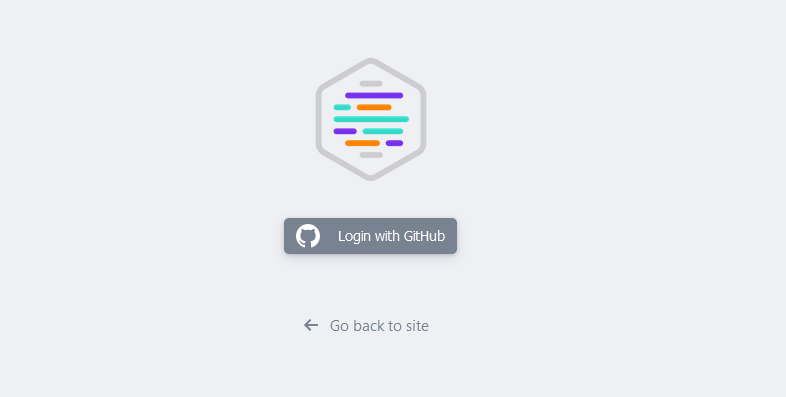</center>

3. If you are prompted to authorize the "HPE Dev Web Portal CMS" by HPEDevCom, please click "Authorize HPEDevCom" 

<center>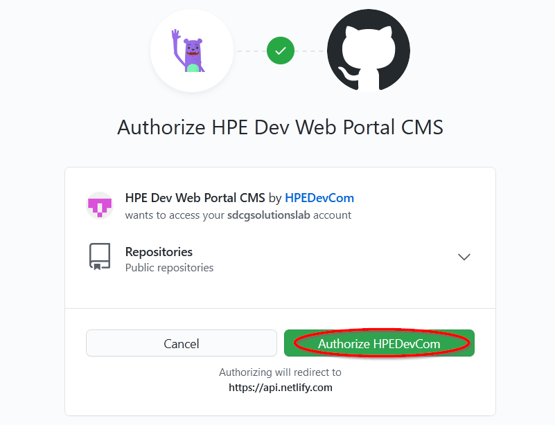</center>

4.  Select **Fork the repo** to initiate a copy of the HPE Developer Web CMS
    into your own GitHub account. (In GitHub, this will appear as a new
    repository: ***yourAccountname/hpe-dev-portal***). This private copy of
    the repository is going to be used to make your changes to the web
    site, before submitting them to the HPE Developer team.

<center>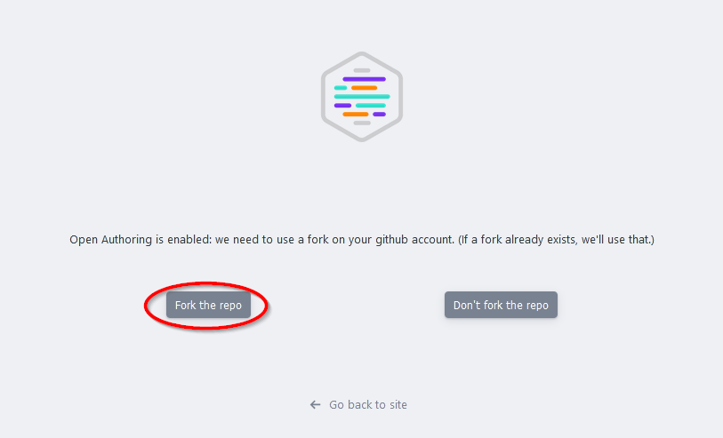</center>


5.  You can view this forked repo in your repository list of your GitHub account.

<center>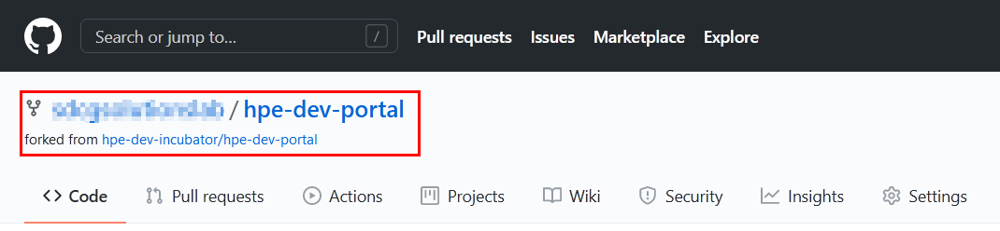</center>


6.  In CMS, you are now working with your own copy of the HPE
    DEV CMS, and you get presented with a **Contents** menu that allows
    to change all sections of the web site. This guide, however, only covers
    changes to the **Blog**, **Platforms** and **Events** sections.

>Note: Please engage with the HPE Developer team before proposing changes to other sections.

<center>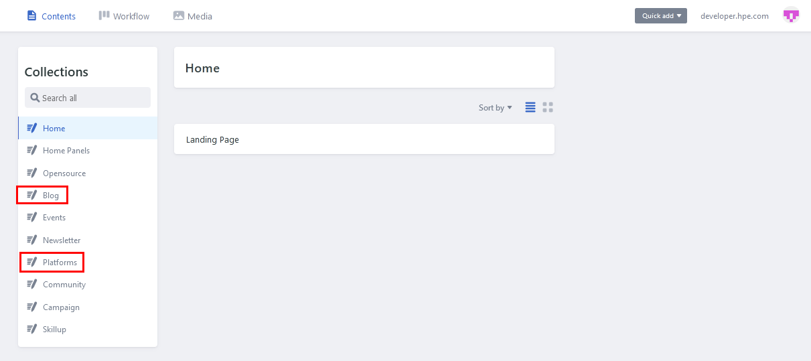</center>

## Contributing a new blog
You can create a new blog directly from the **Contents** tab or by navigating to the **Workflow** tab. Here's how you can create a new blog directly from the **Contents** tab.

>**IMPORTANT NOTE about Social Card creation for the promotion of your blog post:** _Every blog post *should* (if at all possible) have an image associated with it that can be used to promote the post on social media placed as either as **Thumbnail image** (recommended) or as the **first image** in the post. Therefore, the image which tells the best story about what the blog post is about should either be inserted as a Thumbnail image (recommended) or be the first in the post. Twitter and LinkedIn will automatically pulls the Thumbnail image if it exists, or the first image of the post (if a Thunmbnail image is not added to the post) and the first sentence from the post when creating social card for the blog post._

1.  From the **Contents** tab, select the **Blog** section in the Collections tab, and click the **New Blog** button. This opens the editor.

<center>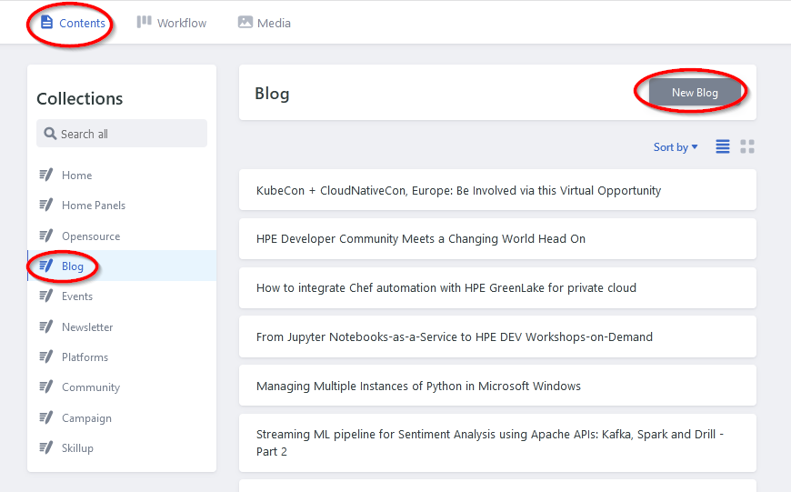</center>


2.  In the blog editor, you can set properties (title, author name, author picture) in the left pane and see
    the effect in the preview pane on the right side of the screen.

<center>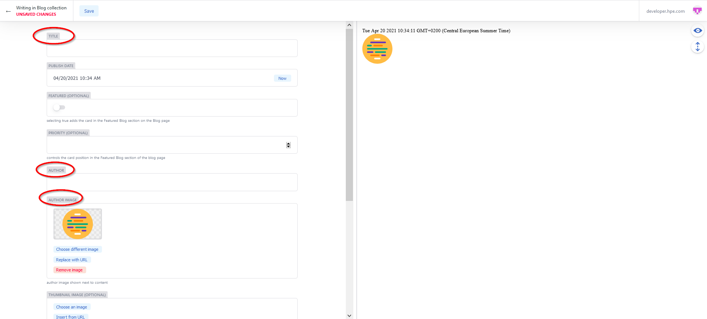</center>


3.  Make sure you set the following parameters:

    -   **Title**
    >Note: The recommendation is to keep it as short as you can while capturing the reader's attention. Also, title must be ***Sentence case*** (that is, capitalize the first letter of the word of the title - HPE brand is moving away from the use of title case, so unless words are used as a proper noun (like the name of a product or program), the general guidance is to use initial lower case letters).
    -   **Author name**
    -   **Author Image** (image size recommended is **192px X 192px**). 
        You can upload a picture or use your gravatar picture URL if you have one. 
        
        >Note: For more information on how to get a gravatar URL, refer to section "***Tips and Tricks using the CMS Editor***" at the end of this document.

    - **IMPORTANT NOTE: Thumbnail image** for Social Media card: although a Thumbnail image is an optional element of the post, it is **highly recommended** to add a Thumbnail image to your blog post that you want to use to promote the post on Social Media such as Twitter and LinkedIn. If you do not add a Thumbnail image, the first image in your post will be used. The thumbnail image or the first image of the post should tell the best story about what the blog post is about. The following image sizes have been tested successfully: **512x400** and **1200x675**.
    
    
4.  Start writing the content using either **Rich Text** mode or **Markdown** mode in the *BODY* canvas.   

<center>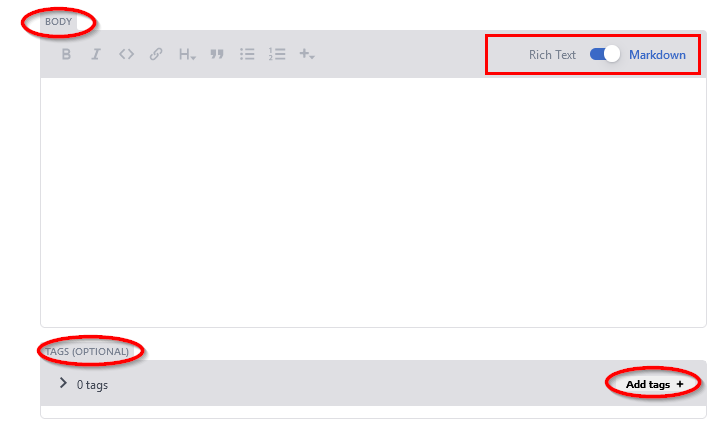</center>

* Use **Markdown** mode when your source file is in Markdown file or when you are familiar with Markdown syntax. If your content is already in Markdown, simply use copy (CTRL+C) and paste the content in **PLAIN TEXT** (**CTRL+SHIFT+V**) in the body canvas. You might find easier to go and paste it a paragraph at a time and then format it.

* Use **Rich Text** mode when your source file is an MS-Word document or a RTF document: simply copy the content from your source file and paste the content in **PLAIN TEXT** (**CTRL+SHIFT+V**) in the body. You might find easier to go and paste it a paragraph at a time and then format it.

 >Note: To get started using the CMS editor for common elements (headings, list, code blocks, bold, italics, image), refer to section "***Tips and Tricks using the CMS Editor***" at the end of this document.
    
    
5. Tag your blog post.

You can tag your post to tie it to one of the HPE Developer "Platform" pages on the HPE Developer portal. 
Use tags as one way to optimize your blog post for results from search engines such as Google search engine. You do so by tagging your article with popular keywords (1 to 4 keywords) that reflect the relevancy of your topic. Visit the site [here](https://hpe-dev-portal.netlify.app/tags/) to look for existing tags in our HPE Developer web site.

>Note: For more information on how to use tags and tie your blog post to a "Platform" page refer to section "***Tips and Tricks using the CMS Editor***" at the end of this document.
    
    
6.  As you are adding content to the **BODY** area, you can preview your blog on the right pane.

>**Important Note:** The text font size in the preview area will be smaller than what is rendered in the blog post in HPE Developer portal. 

<center>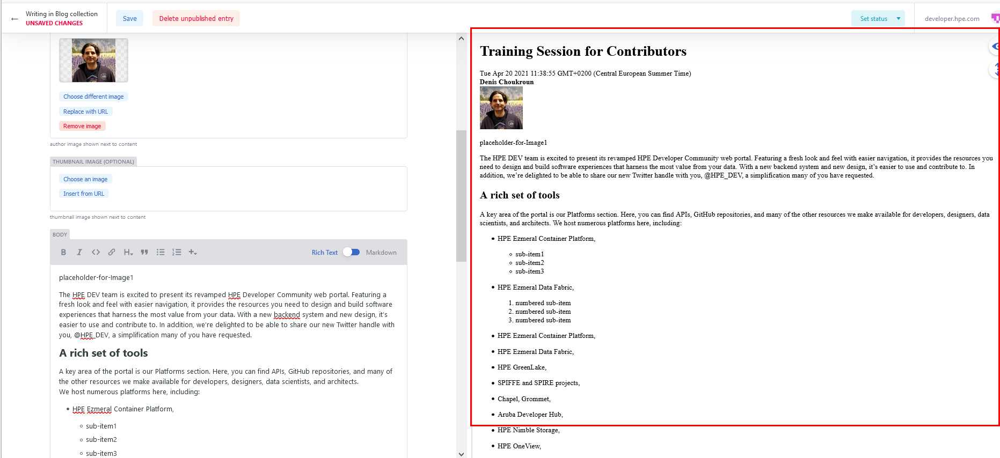</center>


7.  When ready, **Save** your work. 

You can click on **Save** at any time to save your latest edits.

<center>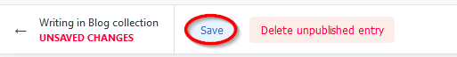</center>

>Note: Click **UNSAVED CHANGES** to exit the CMS editor without saving your changes. Click **Delete unpublished entry** to delete the post entry.


8.  Wait until document is saved.


9.  When Saved, click on **Writing in Blog collection, CHANGES SAVED** to exit the CMS editor and return to the **Editorial Workflow** or **Contents** section.

<center>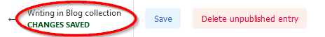</center>


10. From the top menu bar, make sure **Workflow** is selected. Your blog is now visible in the **Drafts** column of the **Editorial Workflow**.

<center>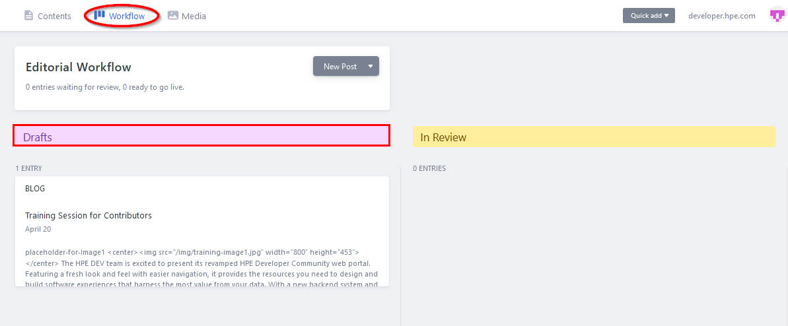</center>


11. Review/edit your post until you are satisfied. When you are ready to publish, move it to the **In Review** column (drag & drop the
    blog entry from the **Drafts** column to the **In Review** column in the **Workflow** area).

<center>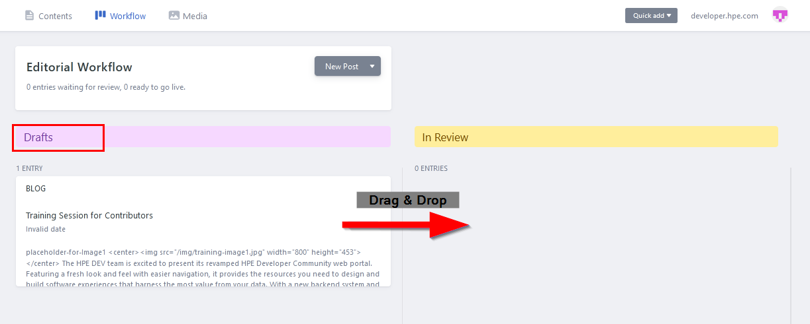</center>

   Alternatively you can use the **Set Status** button at the top right of the screen in the editor menu and set the status to **In Review** as shown here:

<center></center>


12. From the Editorial Workflow section, select your article, now **In Review** column. You will see its status **Check for Preview** at the top right of the screen in the editor menu.

<center></center>


13. In the editor, after about four (4) minutes, you'll notice the **Check for Preview** at the top right has turned into **View Preview**. Click **View Preview** to open a preview of your post and validate your changes. If needed, click **Check for Preview** to refresh the status.

<center>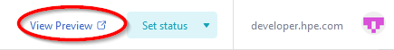</center>

Clicking **View Preview** will open your blog post in a new browser tab for your review.

<center>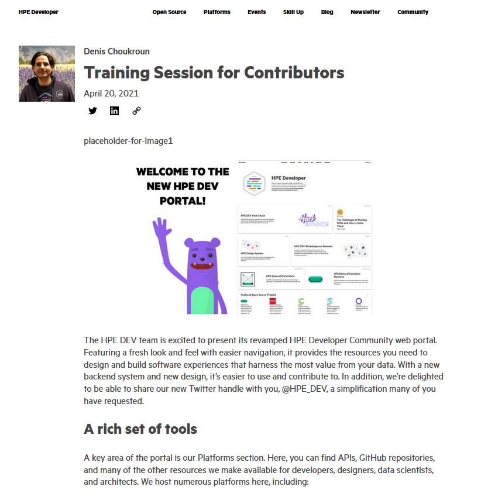</center>

14. Leave the editor using the **Changes Saved** option.

15. As soon as the blog was placed **In Review,** a Pull Request (PR) is automatically opened on the HPE Developer team's GitHub repository, with the new content you are proposing.

<center>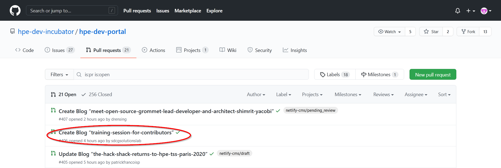</center>


16. Once you have initiated the Pull Request by moving the post into the **In Review** column, and you are satisfied with your blog entry, it is also a good idea to follow up with the [HPE Developer Team](mailto:hpedev@hpe.com?subject=New%20blog%20contribution%20for%20HPE%20DEV) indicating that your new submission is ready for review. HPE Developer team will then proceed with an editorial review and will get in touch with you shortly.

>**Note:** *Moving the blog post back to the **Drafts** column of the CMS will withdraw the PR (the PR will actually be closed). It is recommended you continue to make changes to your blog while the blog is **In Review**. This will be automatically synchronized in the PR (as additional Commits). This will be particularly helpful when receiving feedback from the HPE Developer Team.*

>**Note:** *Once the team has agreed to accept your contribution, the PR will be merged, the blog post will be published to the HPE Developer portal and the blog entry will disappear from your Editorial Workflow.*

## Editing a blog post that is already published
You may want to edit an existing blog post. For example, you may need to update a referenced link that is no longer valid.

1.  From the **Contents** tab, select the **Blog** section, and use the **Sort by** function to sort the blog by title, author name or published date.

<center>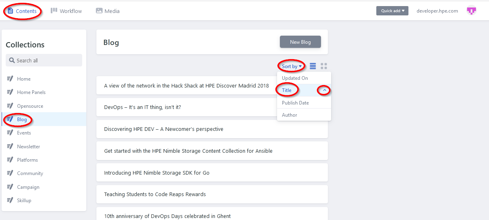</center>

>**Note:** When sorted by Title, the blogs are listed in Alphabetic order. You can click **^** on the right side of Title to list them in reverse order. 

>**Note:** When sorted by Date, the blogs are listed in chronological order from the oldest to the most recent. You can click **^** on the right side of Publish Date to list them in reverse order.

2.  Select the blog you want to edit. This opens the editor.

3. Edit the blog. **Save** it when you have finished making your edits.

4. When Saved, click on **Writing in Blog collection, CHANGES SAVED** to exit the CMS editor and return to the **Contents** section.

5. From the top menu bar, make sure **Workflow** is selected. Your blog is now visible in the **Drafts** column of the **Editorial Workflow**.

6. Review/edit until you are satisified with your copy. When ready, move it to the **In Review** column (drag & drop the
    blog from the **Workflow** area) or use the **Set Status** button at the top right of the screen in the editor menu.

7. From the Editorial Workflow section, select your article, now **In Review** column. You will see its status **Check for Preview** in the editor at the top right.

8. In the editor, after about four (4) minutes, you'll notice the **Check for Preview** at the top right of the screen in the editor menu has turned into **View Preview**. Click **View Preview** to open a preview of your post in a new browser tab and validate your changes. If needed, click **Check for Preview** to refresh the status. 

9. As soon as the blog was placed **In Review,** a Pull Request (PR) is automatically opened on the HPE Developer team's GitHub repository, with the content you are proposing.

10. Once you have initiated the Pull Request by moving the post into the **In Review** column, and you are satisfied with your changes, it is also a good idea to follow up with the [HPE Developer Team](mailto:hpedev@hpe.com?subject=Edition%20of%20blog%20contribution%20for%20HPE%20DEV) indicating that your submission is ready for review. Please provide a brief description of the changes you made. HPE Developer team will then proceed with an editorial review and will get in touch with you shortly.

>**Note:** *Moving the blog post back to the **Drafts** column of the CMS will withdraw the PR. You can also continue to make changes to your blog while the blog is **In Review**. This will be automatically synchronized in the PR (as additional Commits).*

>**Note:** *Once the team has agreed to accept your contribution, the PR will be merged, the blog post will be published with your recent changes to the HPE Developer portal and the blog entry will disappear from your Editorial Workflow.*

11. Leave the editor using the **Changes Saved** option.

## Creating and editing a platform page

>**Important Note:** For the image logo for the platform, make sure you first work with HPE Developer team to determine the best image logo for your platform page. The recommended image size 216px x 216px and format is **SVG** file (an SVG image will not lose quality/resolution when scaled up or down). if needed, HPE Developer team can work with you to design an appropriate image logo for your platform. 

1.  In the CMS, from the **Contents** tab, select **Platforms** in the Collections tab. Click on **New Platforms** button to create a new platform. To edit an existing platform, locate the platform to edit (HPE Ezmeral Data Fabric in our example) and select the Platform. This opens the editor.

    <center>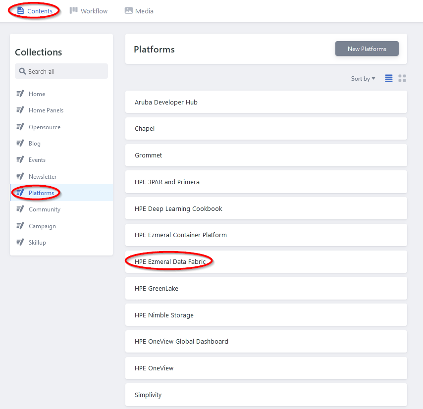</center>

2.  In the editor, for a new platform page, specify a title, description, logo image and content in the Body area. Make the required changes using **Rich Text** mode or
    **Markdown** mode. Verify content in the preview pane on the right side of the screen.
    
    >**Important Note:** Please keep the options "FEATURED" and "ACTIVE" toggled Off.
     
    >**Important Note:** The text font size in the preview area will be smaller than what is rendered in the Platform page in HPE Developer portal. 

    <center>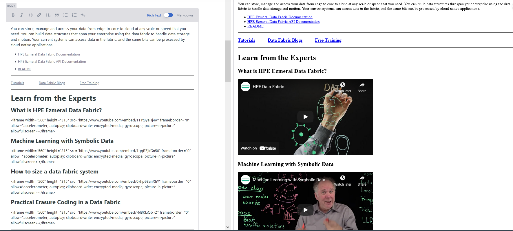</center>

3.  When ready, **Save** your changes.

    You can click on **Save** at any time to save your latest edits.

    <center>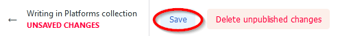</center>

    >Note: Click **UNSAVED CHANGES** to exit the CMS editor without saving your changes.

4. Wait until document is saved.

5. When Saved, click on **Writing in Platforms collection, CHANGES SAVED** to exit the CMS editor and return to the **Editorial Workflow** or **Contents** section.

   <center>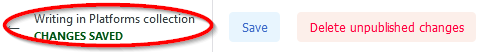</center>

6. From the top menu bar, make sure **Workflow** is selected. Your Platform is now visible in the **Drafts** column of the **Editorial Workflow**.

7. Review/edit your Platform until you are satisfied. When you are ready to publish, move it to the **In Review** column (drag & drop the
    Platform entry from the **Drafts** column to the **In Review** column in the **Workflow** area).

   <center>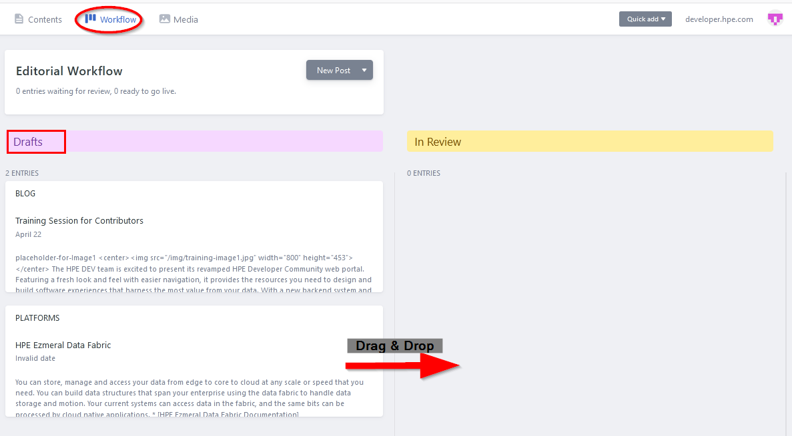</center>

   Alternatively you can use the **Set Status** button at the top right of the screen in the editor menu and set the status to **In Review**. 

8.  From the Editorial Workflow section, select your article, now **In Review** column. You will see its status **Check for Preview** at the top right of the screen in the editor menu.

   <center>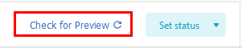</center>

9. In the editor, after about four (4) minutes, you'll notice the **Check for Preview** at the top right has turned into **View Preview**. Click **View Preview** to open a preview of your platform and validate your changes. If needed, click **Check for Preview** to refresh the status.

   <center></center>

Clicking **View Preview** will open your Platform page in a new browser tab for your review.

10. As soon as the Platform entry is placed **In Review,** a Pull Request (PR) is automatically opened on the HPE Developer team's GitHub repository, with the new content you are proposing.

   <center>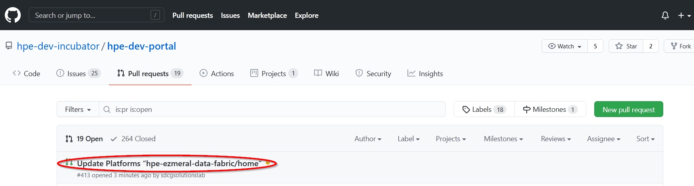</center>

11. Once you have initiated the Pull Request by moving the Platform entry into the **In Review** column, and you are satisfied with your Platform entry, it is also a good idea to follow up with the [HPE Developer Team](mailto:hpedev@hpe.com?subject=Update%20Platform%20contribution%20for%20HPE%20DEV) indicating that your Platform update submission is ready for review. Please provide a brief description of the changes you made on the platform page. HPE Developer team will then proceed with an editorial review and will get in touch with you shortly.

>**Note:** *Moving the Platform entry back to the **Drafts** column of the CMS will withdraw the PR (the PR will actually be closed). You can also continue to make changes to your blog while the blog is **In Review**. This will be automatically synchronized in the PR (as additional Commits). This will be particularly helpful when receiving feedback from the HPE Developer Team.*

>**Note:** *Once the team has agreed to accept your contribution, the PR will be merged, the Platform page will be published with your recent changes to the HPE Developer portal and the Platform entry will disappear from your Editorial Workflow.*

12.  Leave the editor using the **Changes Saved** option.


## Adding an Event

It is possible to add a card to communicate about an important external event or conference you are contributing to. This will be visible on https://developer.hpe.com/events.

To do so, proceed as follows:

1. From the CMS, on top menu bar select **Contents**, then click **Events** in Collections tab and press **New Events**. This will open the Event wizard.

<center>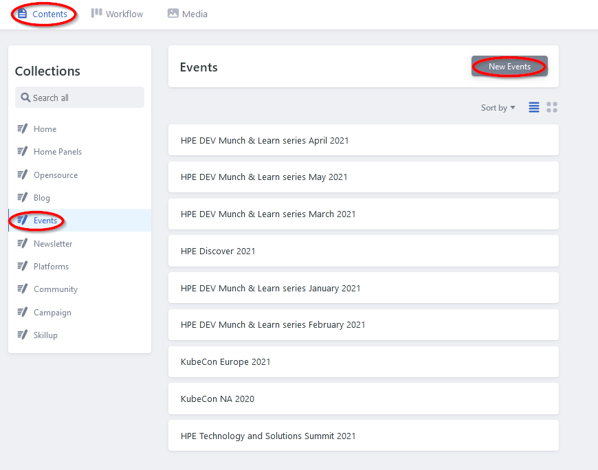</center>

2. Make sure to set the event properties as follows: 
   - Event tile: name of the event or conference.
   - Start date and end date (used by the platform to order and handle upcoming/past status).
   - Category of the event. Select **Event** for in-person event and conference. Select **Virtual Event** for virtual event and conference.
   - Thumbnail Image: a picture for the event. Click **Choose an image** to upload and select a picture. Select **Insert from URL** to enter a link URL for your image.
   - Navigation path: an URL to navigate to register or find out more about the event and conference. This is typically the URL to the event or conference.
   - Leave card size to **large**
   - Tag: specify a keyword for your event or conference. Typically this is the name of your event (for example: Discover, KubeCon). You can also add a "platform" page tag for you revent if it is an event related to an HPE product & solution (see Tags table at the end of this document)

      <center>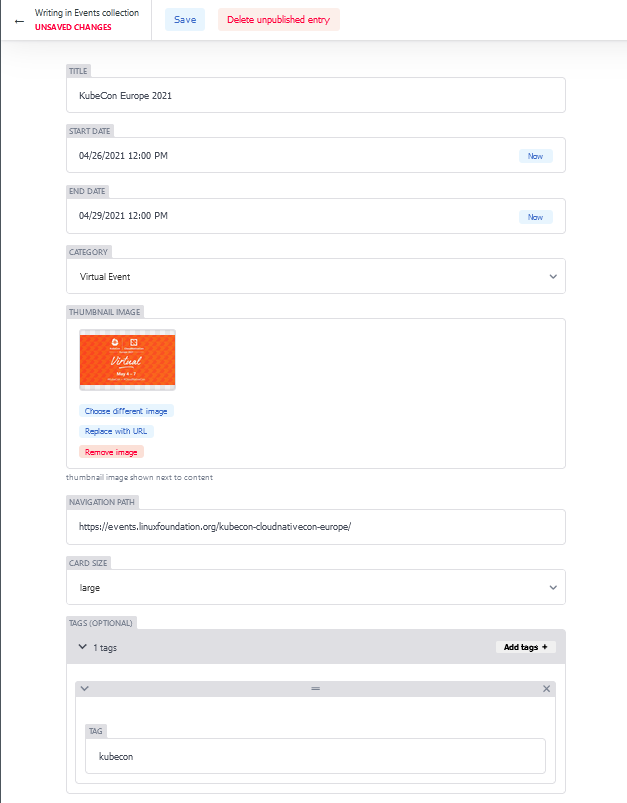</center>
      
3. For the Body, set the content of the card for the event using the following guidelines: 
      - Title (use Heading level 2 for title)
      - Subtitle (optional - use Heading level 3 for subtitle)
      - Date (Month Date-Date, YYYY - for example: May 04-07, 2021)
      - Description

   <center>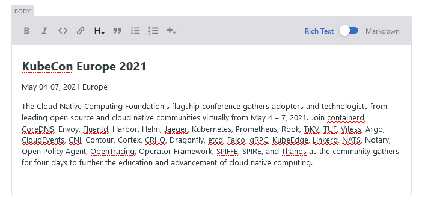</center>

4.   When ready, **Save** your changes. Wait until the document is saved.

     >Note: Click **UNSAVED CHANGES** to exit the CMS editor without saving your changes. Click **Delete unpublished entry** to delete the event entry.

5.  When Saved, click on **Writing in Events collection, CHANGES SAVED** to exit the CMS editor and return to the **Contents** section.

6.  From the top menu bar, select **Workflow** to navigate to the **Editorial Workflow** section.
    Your new event entry is now visible in the **Drafts** column of the **Editorial Workflow**.

7.  Review/edit your event entry until you are satisified. When you are ready to publish, move it to the **In Review** column (drag & drop the
    event entry from the **Drafts** column to the **In Review** column in the **Workflow** area). 
    
    Alternatively you can use the **Set Status** button at the top right of the screen in the editor menu and set the status to **In Review**.
    
8. From the Editorial Workflow section, select your event entry, now **In Review** column. You will see its status **Check for Preview** at the top right of the screen in the editor menu.
 
9. In the editor, after about four (4) minutes, you'll notice the **Check for Preview** at the top right has turned into **View Preview**. Click **View Preview** to open a preview of your event entry and validate your changes. If needed, click **Check for Preview** to refresh the status.
    
10. As soon as the event entry is placed **In Review**, a Pull Request (PR) is automatically opened on the HPE Developer team's GitHub repository, with the new content you are proposing. 

12. Once you have initiated the Pull Request by moving the event entry into the **In Review** column, and you are satisfied with your event entry, it is also a good idea to follow up with [HPE Developer Team](mailto:hpedev@hpe.com?subject=New%20Event%20contribution%20for%20HPE%20DEV) indicating that your new submission is ready for review. HPE Developer team will then proceed with an editorial review and will get in touch with you shortly.

>**Note:** *Moving the event entry back to the **Drafts** column of the CMS will withdraw the PR (the PR will actually be closed). You can also continue to make changes to your event entry while it is **In Review** column. This will be automatically synchronized in the PR (as additional Commits). This will be particularly helpful when receiving feedback from the HPE Developer Team.*

>**Note:** *Once the team has agreed to accept your event entry, the PR will be merged, the event entry will be published to the HPE Developer portal and the event entry will disappear from your Editorial Workflow.*

13. Leave the editor using the **Changes Saved** option.


## Tips and trick using the CMS Editor

-   Unless you have your post already written in Markdown, it is
    recommended to use the "***Rich Text***" toggle option when editing
    your contribution post.

-   Always use the Preview to make sure the changes are what you wanted.
    The WYSINAWYG (not always)

-   When doing copy/paste from an MS-Word (or RTF) document to the CMS
    editor (*Rich Text* mode or *Markdown* mode) use the option
    "***Paste as plain text***" or (**CTRL+SHIFT+V)** to not get unwanted
    XML fragment code syntaxes.

-   You can use pandoc (<https://pandoc.org/>) to convert a complex DOCX
    to Markdown.

    ```bash
    pandoc -f docx -t markdown mydoc.docx -o mymarkdown.md
    ```

-   **Tip #1: Author image:**
    
    - When creating or editing a blog post, in AUTHOR IMAGE section, you can **Choose an image** and upload an image of size: **192px x 192px** or you can insert a Gravatar picture URL (**Insert from URL**). To create a Gravatar URL proceed as follows:

        - Using your gravatar as an author picture

          - Use your email to set up your gravatar account (<https://gravatar.com>)

          - Compute your email MD5 hash by entering your email in <https://www.md5hashgenerator.com/>

          - Check that your picture is reachable with:
        [https://gravatar.com/avatar/\<YourHash\>?s=96](https://gravatar.com/avatar/%3cYourHash%3e?s=96)
        
        for example for an image 96x96 pixel:
        [https://gravatar.com/avatar/7dd708edf1c50d4c45da80f60e3643e7?s=96](https://gravatar.com/avatar/7dd708edf1c50d4c45da80f60e3643e7?s=96)
        
        for example for an image 192x192 pixel:
        [https://gravatar.com/avatar/7dd708edf1c50d4c45da80f60e3643e7?s=192](https://gravatar.com/avatar/7dd708edf1c50d4c45da80f60e3643e7?s=192)

         - Use this URL from now on as your picture in the CMS (and elsewhere)

-   **Tip #2: Headings:**

    Select **H** in the "Rich Text" menu bar and select the
    heading level. To clear a Heading, put your cursor in front of the text, click **H** in
    the menu bar, and click the Heading level previously selected. Another option is to use the ***Undo*** function **CTRL + Z**

    >**Note:** We recommend to use "**Header 2**" for your primary heading, and "**Header 3**" for subsequent heading, etc.

-   **Tip #3: Undo function:**
    
    The CMS editor does not provide an "Undo" button. Use the shortcut **CTRL + Z** for Undo action.

-   **Tip #4: Hotlink:**
    * To hotlink a piece of text, you can use the **Rich Text** mode, select the text you want to hotlink and click the `Link` icon on the editor menu (BODY section) and specify the URL.
    
    * You can also toggle to **Markdown** mode, and use a a combination of square and round brackets as shown below:
    
         \[Piece-of-text-to-hotlink](Link-URL)
          
    
-   **Tip #5: Insert an image in a blog post:**

     >**IMPORTANT NOTE:** If your images are stored in **a personal website** you owned, it is recommended to proceed as explained below to get you images uploaded and stored to the HPE Developer CMS rather than using a link URL to your image on your web site. Security filter such as Zscaler may filter your images and make your images unrendered by the CMS. 
     
    Small resolution image is recommended (i.e.: width: 800px)
    

    -   Toggle to **Rich Text** mode in the editor (Body area)

    -   Select **+** to add an image component
    
    -  In the IMAGE wizard, click **Choose an image**  

    -  On the top right of the wizard, click **Upload** to upload the image stored on your PC/laptop and select image you have just uploaded by clicking **Choose selected**.
     
    -  Specify a "**Title**" for your image in the _TITLE_ section of the _IMAGE_ block. The title will appear when the reader hovers or pauses the mouse over the image.
    
    -  Make sure to specify a description for your image in the _ALT TEXT_ section of the _IMAGE_ block. 
    
    >**IMPORTANT NOTE:** Adding a _ALT Text_ will help promote online content in Search Engine such as Google.      

- **Tip #6: Adjusting image size and its position:**

    -   **Method 1 (recommended):** Use HTML code to set the size (height, width) for your image. First, toggle to **Rich Text** mode to insert your image. Then toggle to **Markdown** mode to obtain the relative path for your image (in the form: */img/myimage.png*) and **substitute** the line **"\!\[\](/img/myimage.png)"** with the HTML syntax below:

        \
        
        or you can use percent value to reduce the size of your original image:
        
        \

        >**Note:** To get appropriate Horizontal and Vertical pixel values, you may want to use the "Resize" fonction of your "Paint" (or equivalent) application. 
        
        >**Note:** If you wish to center an image, then you can use HTML code below:

         \<center\>\\</center\>


        >**Note:** When using HTML code to insert an image, you will see *an empty frame* for your image in the preview area (right side of the CMS editor). The frame corresponds to the size of the image (width and height) in the blog post. Adjust the width/height value as appropriate. You will also lose the description (title specified while in Rich Text mode) of the image.

        >**IMPORTANT NOTE:** Adding a _ALT Text_ will help promote online content in Search Engine such as Google.  

    -   **Method 2:** Using your PC/Laptop, change image size using you preferred image editor (i.e.: Paint). Toggle to **Rich Text** mode and upload/select the resized image.
 
- **Tip #7: Adjusting the font size of a text:**
 It may happen that you want to put a sentence (such as a footnote - see example below) in a smaller font size. Use the HTML code below. You adjust the font size number from 1 to 4, where 1 is the smallest font size.
 
 \<font size="2"\> _Apache® and Apache Spark™ are either registered trademarks or trademarks of the Apache Software Foundation in the United States and/or other countries. No endorsement by the Apache Software Foundation is implied by the use of these marks._ \</font\>
 
- **Tip #8: Embed a YouTube video (HPE Approved video) in a blog or in Platform page:**

    To insert a YouTube video — that has gone through the legal Marketing Asset Publishing (MAP) process — in a blog post or a "platform" page proceed as follows:
    * Go to your YouTube video URL
    * Select ***"Share"*** option just underneath the video frame
    * Select ***"Embed"*** option
    * Copy the HTML code that is displayed, starting with <iframe width...> and ending with </iframe>
    * in the CMS editor, toggle to **Markdown** mode, and paste (CTRL+SHIFT+V) the embedded HTML code. 

- **Tip #9: Inserting Horizontal separator:**

    Toggle to **Markdown** mode and use the "- - -" (without the quotation mark).

    >**Note:** Make sure to insert a line break before and after the horizontal separator.

- **Tip #10: Inserting Code block snippet:** 

    You can use **Rich Text** mode (Select **+** to add a Code Block component) or use **Markdown** mode by placing triple backticks ***\`\`\`*** before and after the code block to include code block snippets in your blog post.

    -   Make sure to always specified a syntax language (for example: ***\`\`\`yaml***). While in **Rich Text** mode, you can select the syntax language. If you do not find an appropriate language for your code snippet, we recommend you to use the syntax language ***Markdown***.

    -   Make sure to insert a line break before and after a code block snippet

- **Tip #11: Inserting "em-dash" character:**

    The CMS editor does not correctly interpret the em-dash (\&mdash;\) markdown syntax. Using the Rich text or Markdown mode of the CMS editor, should you need to use an em-dash character, you can do a copy/paste of the em-dash character here: — 
    
- **Tip #12: Inserting a Line Break in a paragraph:**

  To insert a line break in a paragraph, while in **Markdown** mode, you can use the HTML syntax \<br \/\> at the end of the sentence. 
  
- **Tip #13: Inserting Special characters:**

    Some characters (underscore, hash, backslash) have special meanings in the Markdown syntax. If you want to use these special characters in a text, you have to _escape_ them. The way to escape a special character is to add a backslash (\\) before it, for example: I do not want \\\_italic text\\\_ here. 

- **Tip #14: Inserting List items/sub-list items:**
    To deal with item list, it is recommended to toggle to **Markdown** mode in the editor and use the syntax below for creating item lists and sub-item lists:
    
    >**Note:** Only a certain level of bulleting is supported; i.e. you can't do 1a, 1b, etc.
    
    **Bullet list:**

       *<space>bullet list item 1

       *<space>bullet list item 2

       *<space>bullet list item N
        
    **Numbered list:**

       1.<space>numbered list item 1

       2.<space>numbered list item 2

       N.<space>numbered list item N
        
    **Item list with Sub-item list:**

       *<space>bullet list item 1

       <space><space><space>* sub-item 1

       <space><space><space>* sub-item 2

       <space><space><space>* sub-item N

 >**Note:** Always insert a line break between a standard paragraph and the first item of a list

 >**Note:** By default, the bullet list items will be rendered with smaller font size than a text in a "standard" paragraph. If you wish to keep same character font as a standard paragraph, it is recommended to insert a line break between list items. Alternatively, you can use an HTML style as explained in the next tip: "**Global Styles**".

Example **with line break** between first level list items and **no line break** between sub-list items:

<center>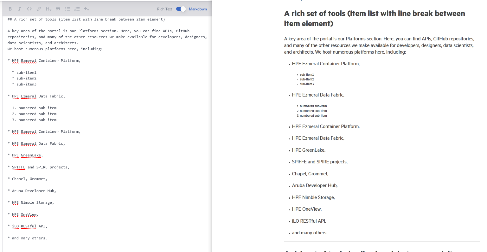</center>

Example with **no line break** between list items:

<center>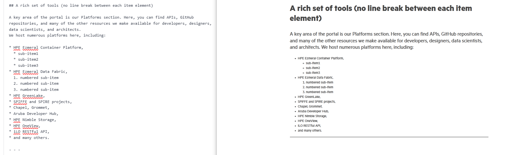</center>

- **Tip #15: Global styles**
    
  You can use the tips below to format tables and bullet list items throughout your blog post. These styles apply **globally** to your post.

***Formatting the bullet list to standard text size***
    
  >Note: As explained in the tip "**Tip #14: Inserting List items/sub-list items**", the bullet list items will be rendered with smaller font size than a text in a "standard" paragraph. You can adjust the size of the bullet list items using the HTML style below: 

   Insert the following Style statement in your markdown at the beginning of your post. The standard text size is 25px. 
   You can use different font-size according to your needs. The font-size will then apply to **ALL** the bullet lists in your article. 
       
```html
<style>
ul li{
 font-size:25px;
}
</style>
```       

Similarly you can change the numbered lists font-size with the following global statement:

```html
<style>
ol li{
 font-size:25px;
}
</style>
```     
<br/>

***Formatting a table properly***

   To format correctly a table, insert the following Style statement in your markdown at the beginning of your post:


```html
<style>
table {
    display: block;
    width: max-content !important;
    max-width: 100%;
    overflow: auto;
     -webkit-box-shadow: none;
    -moz-box-shadow: none;
    box-shadow: none;
    border:1px solid grey;
}
td {
   -webkit-box-shadow: none;
    -moz-box-shadow: none;
    box-shadow: none;
    border:1px solid grey;
    text-align: left !important;
     font-weight: normal !important;
    padding: 10px !important;
}
thead tr:first-child td {
  -webkit-box-shadow: none;
  -moz-box-shadow: none;
  box-shadow: none;
  border:1px solid grey;
  text-align: center !important;
  padding: 20px !important;
  font-weight: bold !important;
}
</style>
```
       
- **Tip #16: Adding GitHub repo with the CAT logo in a platform/technology/opensource page**

To add a the GitHub repo URL in a platform/Technology page, you can use the markdown syntax below. This syntax will display the "GitHub" CAT logo just at the right of the text. 

\[HPE Swarm Learning Community Edition \!\[](Github)\](https://github.com/HewlettPackard/swarm-learning)


-  **Tip #17: Tagging:**

If appropriate, use a tag to tie your blog post to a "platform" page on HPE Developer portal. List of "platforms" tag is in the table below.

>**Note:** You can also tag your article with popular keywords (1 to 4 keywords) that reflect the relevancy of your topic. Use tags as one way to optimize your blog post for results from search engines such as Google search engine. Visit the site [here](https://hpe-dev-portal.netlify.app/tags/) to look for existing tags in our HPE Developer site.

>**Note about HPE GLCP**: When tagging blog posts for DSCC, COM and Aruba Central, please add the tag hpe-greenlake-cloud-platform because COM, DSCC and Aruba Central are native SaaS-based console delivered from HPE GreenLake Cloud Platform.

  | **Platform name**                  |   **Associated tag**    |
  | ---------------------------------- | ----------------------- |
  | **HPE Ezmeral**                    | hpe-ezmeral     |
  | **HPE Ezmeral Data Fabric**        | hpe-ezmeral-data-fabric |
  | **HPE GreenLake**                  | hpe-greenlake |
  | **HPE GreenLake for Compute Ops Management** | hpe-greenlake-for-compute-ops-management |
  | **HPE GreenLake Cloud Platform**   | hpe-greenlake-cloud-platform |
  | **Data Sevices Cloud Console**     | data-services-cloud-console |
  | **Spiffe and Spire**               | spiffe-and-spire-projects |
  | **Chapel**                         | chapel |
  | **Determined AI**                  | determined-ai |
  | **Grommet**                        | grommet |
  | **Aruba Developer Hub**            | aruba |
  | **HPE 3PAR and Primera**           | hpe-3par-and-primera |
  | **HPE Nimble Storage**             | hpe-nimble-storage |
  | **HPE OneView**                    | hpe-oneview |
  | **HPE OneView Global Dashboard**   | hpe-oneview-global-dashboard |
  | **HPE SimpliVity**                 | hpe-simplivity |
  | **iLORESTful API**                 | ilo-restful-api |
  | **HPE Alletra**                    | hpe-alletra |
  | **SmartSim**                       | smartsim    |
  | **Zerto**                          | zerto   |
  | **Project Data Map**               | project-data-map |
  | **KubeDirector**                   | kubedirector |
  | **HPE Swarm Learning**             | hpe-swarm-learning |
  
  
  
  
